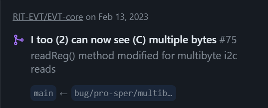
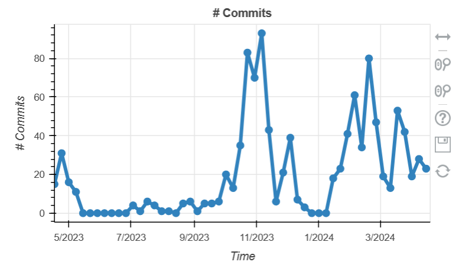
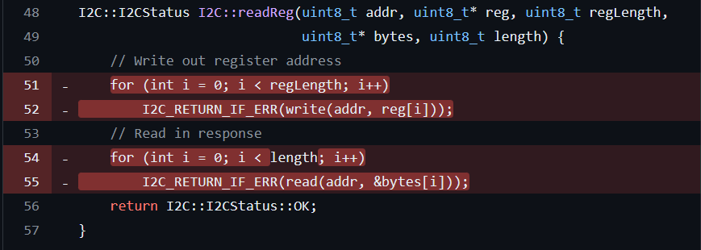
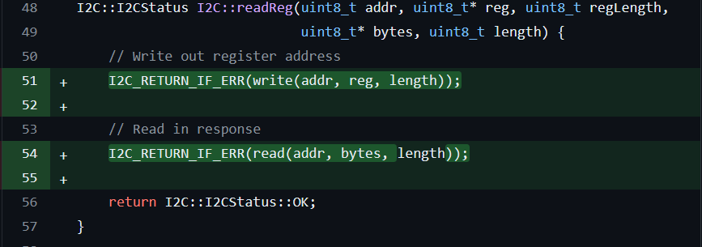

 

The pressures of group projects can be a weird dynamic to navigate. Especially as one very early in my career, it has turned out to be a constant personal experience characterized by a need to prove myself. I joined the RIT Electric Vehicle Team in August 2022. Fresh out of my first Embedded programming class which I thoroughly enjoyed; I was convinced I would easily hit the ground running and in no time, be the go-to guy for all things Firmware on the team. The class was done in pretty much 95% ARM Assembly Language and only the final Lab Exercise had a C component for the main program, but I still thought it would be straightforward to pick up the team's stack which consists of pretty much pure C++.

Suffice to say, that hasn't ended up being the case. However, I've developed a couple features, and done a few bug fixes (That I'm proud of!), so here's my two experience working on a specific bug I fixed last year.

 
Figure 1: Summary clip of Bug Fix

I will start by stating the preliminaries - I chose this project simply because it is something I have worked on for a little while now and already have pre-existing knowledge of. I didn't use my Comm Arch experience to determine whether it would be good to work with, however, I did run a Caudron scan on the overall repo, producing data from which we can see that the activity (during the school year since it is a school project) is pretty high and fairly stable.

 
Figure 2: Cauldron stat for RIT-EVT

## The Issue
Our I2C's `readReg()` method wasn't reading multi-byte registers correctly. When reading more than 1 byte from a register, the STM (the primary microcontroller used in this project) basically seemed to read a number of individual bytes with no ACK between them. An ACK (which is short for acknowledgement) designates the start and end of different bytes in the data stream.

## The Contribution
I created a new branch off of EVT main and began gathering information. Being my first real team contribution, the team lead took it upon himself to thoroughly explain how the technology I2C works. I also did some research on it to see how I would apply that knowledge to fix the issue. 

Because it was an issue involving using the same method to do slightly different things with different parameters, this was a textbook case of a need to implement polymorphism.

 
Figure 3: `readReg()` method with a bug in it

The code above shows the original state of the `readReg()` method, which made use of loops attempting to use the length of the register, regLength, which is passed in as a parameter, as a limit for when to stop reading the bytes. However, the ACK is already supposed to do the job of designating individual bytes.

By referencing the HAL (Hardware Abstraction Layer -which is pretty much what python is to raw C: wrapping functionality in slightly more human readable formats, just specific to the hardware being used in this case) documentation and reading the code itself, I found that the `write()` and `read()` methods take care of the ACKs within their implementation, so I got rid of the loops, and it functioned as expected. This was where the polymorphism was already implemented, so it just needed to be called by passing in the right number of parameters - which in this case was done by adding "length".

 
Figure 4: Fixed method

## The Merge
Merging the change wasn't too much of a hassle, however, like any decently collaborative team normally should have, the team has a policy that 3 people must review the pull request before it can be merged. This was quickly achieved as the functionality could be verified on anybody's local machine.

## Conclusion

This was a good introductory and beginner friendly bug to work on and fix in my early days as an Electric Vehicle Team member. It gives a glimpse into the sort of things one might have to be mindful of when developing embedded software for multiple ECUs (Electrically Controlled Units) because of the nature of the elements which calls for reusability when possible. It is important to seek help when lost and listen attentively to gain insights on whatever you are working on, because it is quite literally the light with which we see the way toward making any progress at all!

