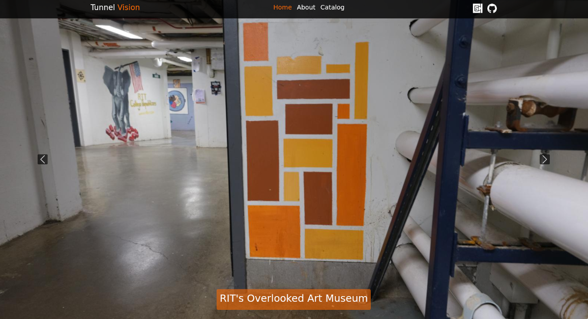
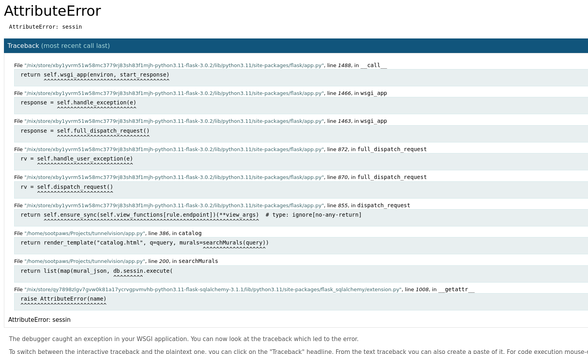
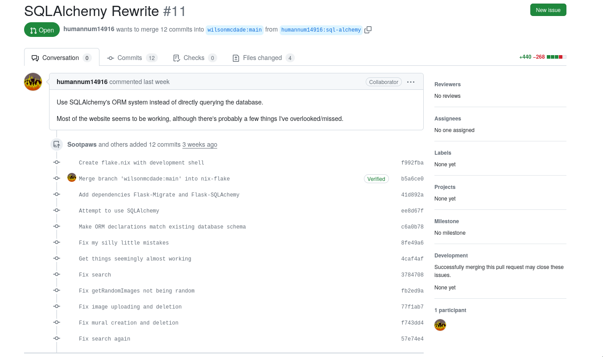

# Tunnelvision

[https://tunnelvision.csh.rit.edu](Tunnelvision) is a catalog of RIT's dorm
tunnel murals, created by fellow CSH member Wilson McDade. He also helped found
the Tunnel Art Group, or TAG (which isn't yet an official club; we're working on
it) which is how I got involved with the project. The community is very small,
Tunnel Art Group is only about 10 people and Tunnelvision itself is almost
entirely maintained by Wilson. As web maintainer for TAG, I'm going to be taking
over maintaining Tunnelvision after Wilson graduates next semester.

# Community Evaluation

Tunnelvision is a very new and very small project, and the only available
resources are the source code itself, >10-line README, and the exiting
maintainer, Wilson. From an outside perspective (randomly finding the repository
on Github) it definitely isn't a great project to try and contribute to due to
the lack of resources and small community.

While in my previous post I mentioned that I really enjoyed working on Clippy
and the Rust community, I didn't feel ready to start making larger changes with
so little experience. Tunnelvision was a project I was already somewhat involved
with, and felt a lot more comfortable jumping into.

# Choosing an issue

One of the things Wilson mentioned wanting to do on the project was improve the
way the backend interfaced with the database of mural data, specifically using
a library called SQLAlchemy. Since I'm going to be working with the project a
lot, this seemed like a good place to start. However, this was a pretty big
challenge to take on - before this, I had never done work with a database
before, and the backend was written in Python, a language I'm a lot less
experienced with.

# Preparation and setup

Before starting on the actual refactoring, I spent a few days preparing my
development environment and learning about the different libraries I'd be
working with. I also went through the source code for the backend to get an idea
of how extensive the changes would need to be. The final step was getting the
credentials for accessing the development database, which took a while to get
coordinated.

# Doing the refactor

The actual refactoring ended up mostly being a game of find-and-replace, looking
through the code for places that accessed the database and replacing them with
the SQLAlchemy equivalents. However, the code responsible for taking database
responses and sending them out to the client ended up needing a lot of work,
due to the new database interface not returning raw values like the old one.

# Testing

Once the initial refactoring was done, I started the long journey of testing and
debugging. At first, the server couldn't even send the front page without
crashing, but slowly that changed to being able to do the landing page, then the
catalog page, then use the search system. The hardest part to deal with was the
admin panel, since it was the only part of the site that needed to send data
back to the server and modify the database. I ended up having to directly
connect to the database a few times to remove improperly-deleted data, but I did
manage to get it sorted out.

# Submitting the changes

Now that the modifications were done, I pushed the changes to my fork and
submitted a pull request. However, at this point it was finals season, and since
both Wilson and I are students, merging the PR got pushed down the priority list
for the time being. At this point, it probably won't see any progress until
summer.

# Conclusion

This contribution was a very different experience compared to my previous work
with Clippy, in both positive and negative ways. Things were definitely a lot
less organized and there were fewer resources, but it was really nice working on
a smaller project and really becoming part of the community. In the future I'm
planning on using what I've learned coming into this project to make the
contribution process easier for future contributers.
