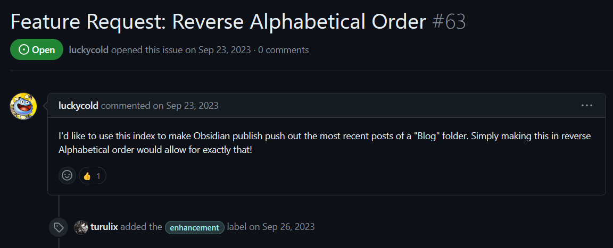
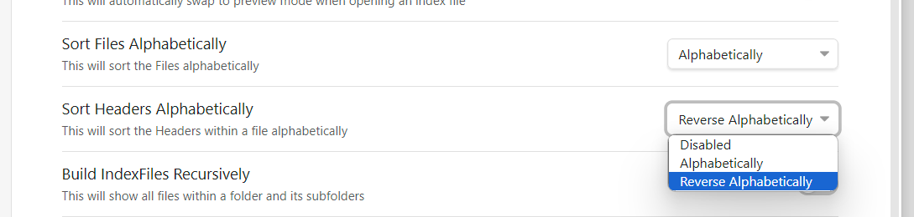
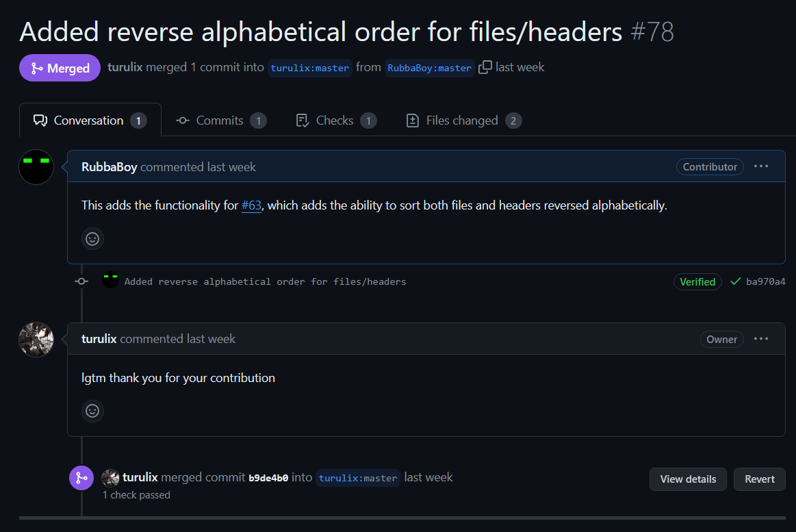

## What/Why an Obsidian plugin?
Obsidian is a piece of software for note-taking and to be used as a knowledge database. Despite being closed source, it uses markdown for its files, and also has a large plugin ecosystem and an API to use with it. For my bug fix, I worked with an Obsidian plugin I had used in the past, and it was a surprisingly challenging task, with my lack of domain knowledge for this. I thought about doing something with the same plugin again, but wanted to change it up a little bit. I eventually ended up working on a plugin for creating automatically updating file indexes called Obsidian Folder Index, that is highly configurable and extremely useful, and I will definitely be using it in the future.

When browsing the plugin's GitHub issues, I had noticed a bunch unresolved. There wasn't much rhyme or reason to the issue I selected to work on, however I figured this would be a good introduction into working with this plugin, as I was unsure how it even worked. I ended up choosing an issue asking to add reverse alphabetical order on sorting indexes. I had no idea how they implemented this originally, so I figured this would be a great first issue to tackle. This issue was made in the latter half of last year, so it seemed clear that the community wanted it and it likely wasn't going to be implemented unless someone did it themselves.

## Why was this project chosen?

To be honest, a high Comm Arch score wasn't my defining decision in choosing a project. I originally wanted to work on a larger project with likely a near perfect score, however, those projects get hundreds/thousands of contributors, and while very needed for sustaining large projects, I had done that before and wanted to make a bit more of an impact. I decided to choose this project because it was smaller, very clearly actively used by people, and it looked like it needed some help, as it was only a few developers working on it. It definitely isn't a bad project to work on, it just needed a little help.

## Implementation

From my bug fix, I already had a little experience working with Obsidian plugins. The only issue is that this functionality required some features that were surprisingly difficult to use, which I will get into later. The issue that I had selected requested reverse alphabetical order for files, however upon installing the plugin I had noticed that right below it in the settings, there was an option to sort headers in alphabetical order too. I figured since I was working on something similar, I might as well add additional sorting for that as well.

Outlining the problem, I needed to change a few things. First, I needed to add a dropdown to replace the boolean options for the relative settings. Then, I needed to identify where sorting was done for both files and headers.

Adding the dropdowns was a surprisingly difficult task to figure out. The plugin was written in TypeScript, which I have worked with a little before, and I didn't expect the language barrier to be a part of an issue. This, and lack of documentation, made this a little challenging. The plugin used a method called `addDropdown` which was documented to the extent of saying what the single argument it took was (which was a callback that accepted a component object to manipulate), however that's about it. Actual usage of this method was not shown or described, and there seemed to be little sources on the internet of how to actually use this properly.

Luckily, the project for my bug fix used dropdowns, but only with a single option for some reason, so it appeared to be half-baked into the plugin. I was able to use this as a starting point of how to use it. From what I could gather, each option within this component would have a dropdown item added via `addOption`, which again had little information on it. After that had been done, the _current_ value had to be set via `setValue`, with a change listener applied to this, to save the settings.

One thing that made this difficult to do is that I wanted to use enums for this, as it made it the most expandable, and fool-proof for future devs. This was the language barrier part I mentioned before, as converting between an enum's display name (value), the name of the enum itself, and the enum object proved itself to be extremely troublesome and very hard to comprehend. After a while, I was able to get this working to iterate over the enum options and set the options properly. Each option took in a value, which was saved, and a display string, which was the reason for needing all this information on the enums.


for (const key in SortBy) {
    if (!isNaN(Number(key))) continue;

    const enumKey: SortBy = SortBy[key as keyof typeof SortBy];
    const enumValue: string = SortBy[key as keyof typeof SortBy];
    
    component.addOption(enumKey, enumValue);
}


The most difficult part for me was realizing I had to use the same code but setting it equal to either a string or the enum type, and it would just work. The following is what the dropdowns ended up looking like (previously, they were checkboxes).

From there, I had to figure out how to apply this new way of sorting, which was significantly less of a headache. Along with some additional logic to handle no sorting, the sorting came down to lines similar to this (this is for header sorting, file sorting was similar logic):


headerTree.sort((a, b) => a.header.heading.localeCompare(b.header.heading))


To sort this reverse alphabetically, I was able to switch the items being sorted, which made it go in reverse, to get something like this:


headerTree.sort((a, b) => b.header.heading.localeCompare(a.header.heading))


With this, along with additional integration steps, the enhancement was complete. Aside from the issues with enums, nothing was blocking me from this.

## Success

After these additions were made, a pull request was made and within a couple days, it was reviewed and merged. This will hopefully be the first of many pull requests to either this project or projects like this.

