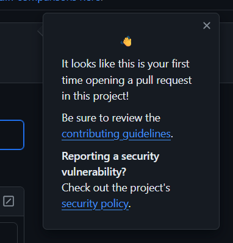
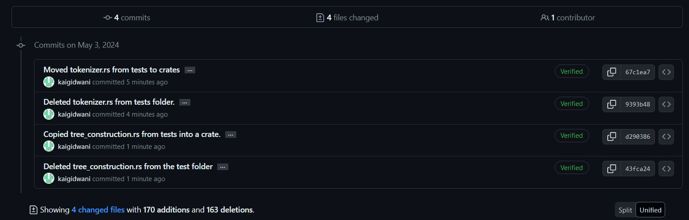
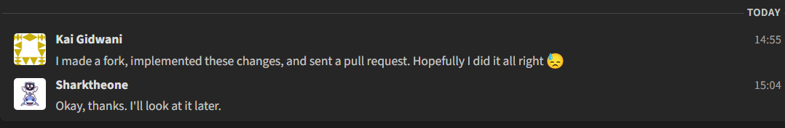

For this contirbution, I chose to contribute to a project called Gosub, a work in progress browser. I decided to work on this project because it had a decently sized community without being too massive, and that was friendly and receptive to newcomers, which was a good sign. It also interested me as an open source browser seemed like an interesting idea, and I liked their submarine branding.

## Introduction to the Community
Gosub, or Gateway to Optimized Searching and Unlimited Browsing, is an open source browser currently being developed. My experience with the Comm Arch assignments and the previous GitHub Bug Fix project helped me to determine that this project would be a good fit for me as a relatively unexperienced newcomer. This project showed good signs such as having a contribution gude, a license, a vulnerability policy, several different chats to talk with the developers and community, and instructions on how to set it up. When I went to submit my Pull Request, it even reminded me of some of them.

## The Issue
I originally found this project while searching [Good First Issues](https://goodfirstissues.com/) for something to work on, as it helped me last time with my Bug Fix. It was provided to me by Elizabeth Barron in her presentation on CHAOSS. The issue is about moving some tests from the tests folder into specific crate folders. Although there was no mention of specifically where to put each item in each spot.

When I found this issue, I first joined their community chat called Zulip because they recommended doing so if you are looking for something to work on. After looking around and getting used to the platform, I created a message in the #help wanted stream. I described why I'm here, how I found the project, and my interest in helping on the issue I found. After I sent this, I also added a similar message on the GitHub issue for consistency.

![A message on Zulip with the thread titled "Looking to contribute / issue #445". The message's body reads: "Hello! I'm new to all of this and looking for a contribution I may be able to make to this project, for an assignment in my class I'm taking on FOSS. I found Issue #445 and this project through goodfirstissues.com and was interested in taking this on, but I am a bit unclear on it. I am unsure specifically which files need to get moved out of the tests folder, and where they should be put in the crates folder. I'm also going to put part of this message onto the GitHub issue for consistency."](../assets/2024-05-03-gosub-tests/zulip-chat-1.png)

A contributor named Shark responded to me quickly and described the issue to me. Shark described that I should move the tokenizer.rs file into the crates/gosub_html5/ folder, which I would never had guessed would have been the correct folder on my own, so this was very useful.

I wrote back explaining my confusion with where exactly to place the test files and my specific confusion of where to place the other file in the tests folder, tree_construction.rs. I did some digging and found a potential spot for it but it seemed like it would cause problems by overwriting another file in that location.

![A Zulip message from Kai Gidwani saying Alright cool. I'm not familiar with Rust but just working on the source and not extra files sounds good to me haha. I can move tokenizer.rs over as you mentioned, but I am unsure where to move the other files to, as it is not immediatley clear to me where its destination should be within the crates folder. As in, I knew the tokenizer.rs file should be moved somewhere within the crates/ folder, but I was not sure it should go into crates/gosub_html5. Looking into one of the other files in the test/ folder, tree_construction.rs, I found a different one that already exists withing crates folder at crates/gosub_testing/src/testing/tree_construction.rs, is that the spot where I should put it? I think it would overwrite the file already there so I am unsure.](../assets/2024-05-03-gosub-tests/zulip-chat-3.png)

Afterwards Shark responded to me with a different potential location for tokenizer.rs, but that it would make more sense in the one they suggested earlier. They also said that if I am to move the file over, I should have #[cfg(test)] above it's module declaration. They then continued that I could add the content of the second file, tree_construction.rs, onto the file with the same name in crates/gosub_html5/src/parser. They said that I should include it under the trait section with the same #[cfg(test)] and a module declaration. This one being written in an embedded code snippet gave me a big hint on how to do it correctly, which was very useful.

![A Zulip message from Sharktheone that says I guess, tests/tokenizer.rs can me moved into here But I'm unsure if it makes sense to have a 2000 line long file and append the tests there. You might be able to put them into the tokenizer folder as test.rs just make sure to have #[cfg(test)] over the module declaration. the tree_construction one could be moved into here. basically under the trait with #[cfg(test)] mod tests { <tests here> }](../assets/2024-05-03-gosub-tests/zulip-chat-4.png)

The next day I responded confirming that I think I could do that. I asked some more questions that weren't asnwered, but I was able to figure out the issue to the best of my abilities without it.

I then created my own branch of the project to make my changes and move the files. I moved the 2 files to their new locations and deleted them in their old spots. I commited my changes which you can see here.

After making these commits I then submitted a pull request to merge my fork with main.

![A pull request titled Moved tokenizer.rs and tree_construction.rs tests into crates for issue #445 which was given the number #457. The comment on the pull request left by kaigidawni says For issue #445, I have copied the tokenizer.rs over into crates/gosub_html5/src/tokenizer as test.rs. I have also moved the contents of tree_construction.rs onto the end of crates/gosub_html5/src/parser/tree_builder.rs. I made sure to add the module declarations and #[cfg(test)] above them.](../assets/2024-05-03-gosub-tests/pull-request.png)

I then posted on the zulip thread that I had made a fork, done the changes, and submitted a pull request for them. To which Shark quickly responded saying that they will look at it later.

## Conclusion
This was my second time contributing to an open source project. This one was significantly more intimidating to me than the previous one for many reasons. First of all I was actually touching code this time, instead of just markup documentation, so the possibility of my change actually breaking something if I did something wrong was higher. Secondly, I have never used Rust before and have not thoroughly learned it, so this was an entirely new experience for me. Thirdly, I asked questions and not all of them were answered. This wasn't the end of the world as I used what I already knew to guess, and talked to our TA Adrian to make sure what I was thinking was on the right lines. Once I knew what to do and how to do it, I found that actually implementing the changes was not very difficult or intimidating at all. I'm glad I got to do this project because it has made me more confident in checking out open source projects, talking to the communities, and being confident in the face of stuff I know nothing about by asking questions. All in all, I enjoyed this project and how it has benefited me as a coder and community member.
