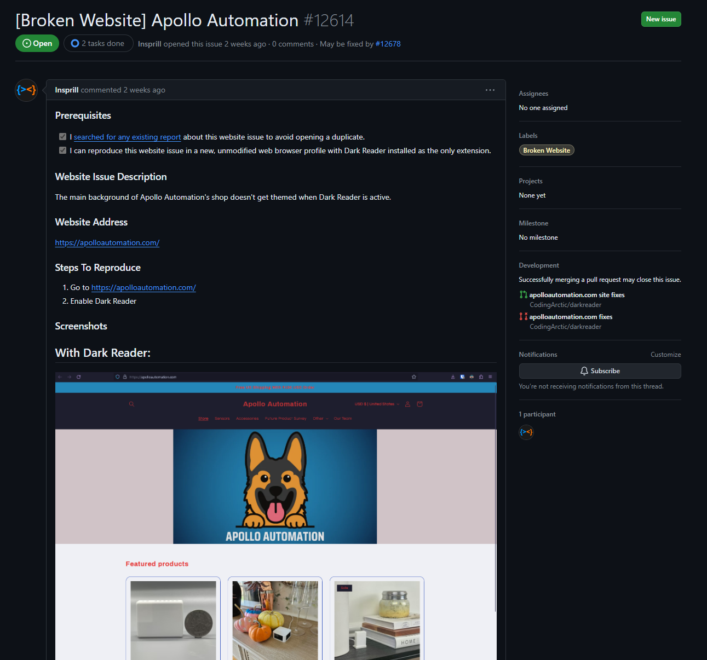
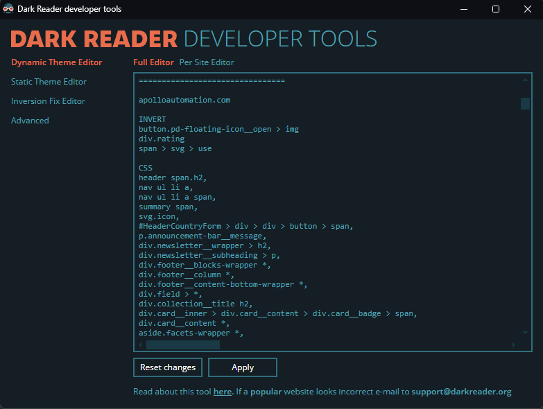
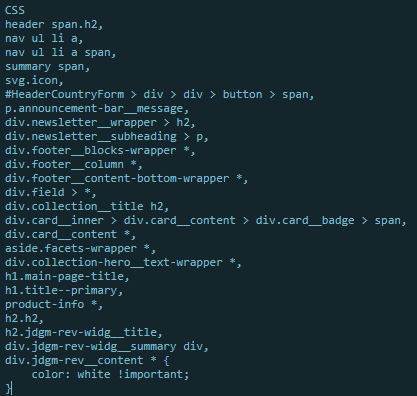
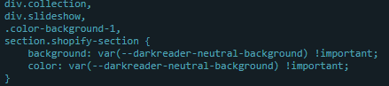
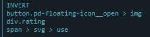
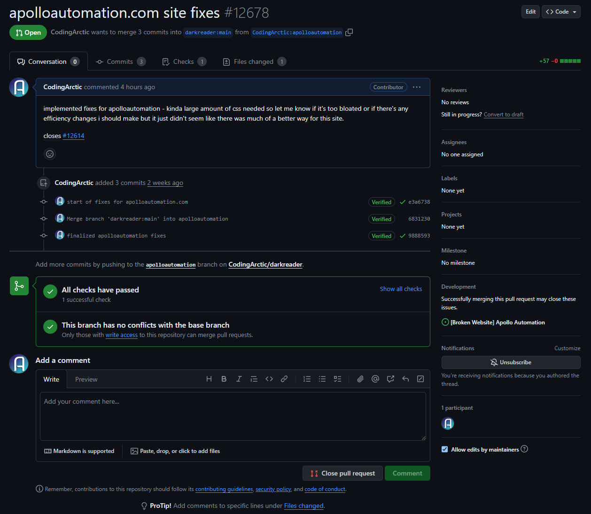

## Dark Reader Recap
To recap what Dark Reader is, it's a browser extension for most platforms. Its main purpose is to apply a dark theme to websites that don’t have one natively. It does this by modifying the colors of the website using their “Dynamic Mode” and applying community-written site fixes to websites where Dark Reader didn’t get it quite right. 

## Why'd I stick with it?
I chose the same project for my Contribution as I did my Bug Fix because I'm familiar with it. It also helps that most contributions are written in CSS, which is one of my strongest languages as a Web & Mobile Computing major. 

## The Issue
For my contribution, I wanted to fix a more substantially broken website, so I took a look through the issues tab on GitHub. I stumbled upon an issue submitted by Insprill about a website that was essentially unchanged by Dark Reader. Another significant part of the issue was that most of the text had changed from white or black to red, which stood out and looked really odd. 

## Starting the Contribution

I started my process by creating a new branch on my existing fork of Dark Reader (since I've contributed there multiple times now). I then opened the website with Dark Reader enabled and opened up the Dark Reader developer tools. The developer tools window is specifically made for Dark Reader contributers and very helpful because it allows you to invert certain elements based on CSS selector, as well as add custom CSS rules to fix websites.

## The Contributing Part

The first thing I had to do was figure out a way to fix the red text that was *all over this site*. I started poking through the HTML hoping to find a variable that was holding this specific red shade and referenced by all the red text. Unfortunately that variable did not exist, and for some reason this RGB red color was just used in so many different seperate spots I had to go after them all seperately. The below image is essentially changing every single place I found red to white as it would work best with the newly dark background. 

There was definitely easier ways to set all of the text to white, but editing entire elements like h1, h2, h3, etc. is highly discouraged when submitting site fixes for Dark Reader. Since the site can be updated by the owner at any time, theres nothing stopping them from adding a new page of the site that might break because of the broad CSS rules applied. This is the reason why I had to find specific class identifiers and patterns of elements to set them to white because I had to make sure my CSS rules were specific enough to not break anything else. 

After the text color was fixed in all the places it needed to be, I moved on to the parts of the background that hadn't been set to dark. (Which was most of them because some large elements had failed to invert correctly) I did this by digging more through the HTML and added the code below.

This code selects all the elements that need to have their background colors adjusted. It then sets the background and color attributes of those elements to a variable called `darkreader-neutral-background`. This part is important because all Dark Reader users can adjust the colors that they'd like for websites to adjust to. If I had set the colors to my preferred gray color, the PR would likely be rejected as contributors are supposed to utilize the user's preferred color whenever possible. 

After making these changes, the website was looking mostly good. There were 3 last things I had to take care of though. The cookie icon, message icon, and rating stars on their product pages were all not visible. For these I was able to take a much simpler approach, as they just had to be inverted to what they were previously. I did this by adding an `INVERT` rule in the Dark Reader dev tools, which looked like the image below.

## Conclusion

After doing all that, I was satisfied with my site fix/contribution. So the next step was to open my PR. I made sure to enable "allow edits by maintainers" in case any of the maintainers had adjustments they wanted to make to my code. I also made sure to add in "closes #12614" in the description because then GitHub would know to link my PR with the issue so that they would both be closed togehter automatically.

I'm currently still waiting for my PR to be reviewed as of 5/4, but overall this was a very positive experience contributing to Dark Reader as it always is. I'm glad I took on a larger site fix for my contribution because it was a fun challenge. My PR can be found [here](https://github.com/darkreader/darkreader/pull/12678), and the original issue [here](https://github.com/darkreader/darkreader/issues/12614). Thanks for reading!