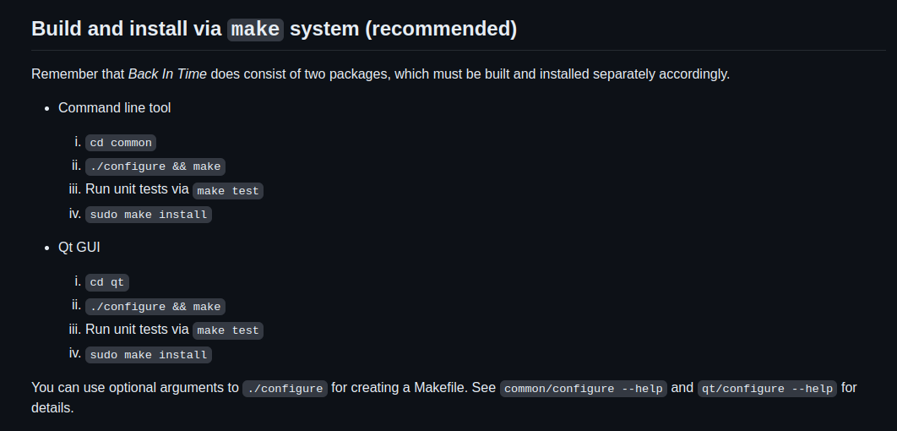
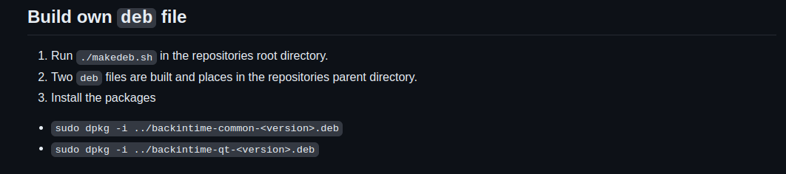
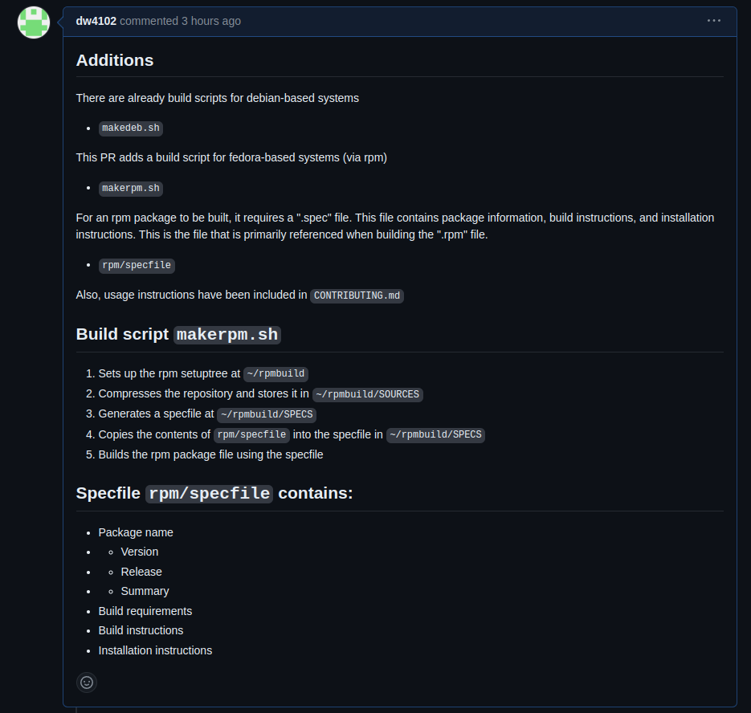

# Backintime backup utility
[GitHub Page](https://github.com/bit-team/backintime) | [PR Link](https://github.com/bit-team/backintime/pull/1711) | [Project Docs](https://backintime.readthedocs.io/en/latest/)

Backintime is an "an easy-to-use tool to backup files and folders" for GNU/Linux. It provides a command-line interface as well as a GUI interface via `qt`. Behind the scenes, it uses the `rsync` utility and completes manual or scheduled screenshots either locally or via ssh. The project is currently maintained by a small team of developers who contribute in their spare time. 

# Getting involved with backintime
The project has [Contributing Guidelines](https://github.com/bit-team/backintime/blob/dev/CONTRIBUTING.md) which refer to open issues and have general contribution instructions. The community is also very welcoming to new contributors. The top of the contributing file holds: 

> The maintenance team welcomes all types of contributions. No contribution will be rejected solely because it doesn't meet our quality standards, guidelines, or rules. Every contribution is reviewed, and if necessary, improved in collaboration with the maintenance team. New contributors who may need assistance or are less experienced are warmly welcomed and will be mentored by the maintenance team upon request.

Everything is pretty standard, and they recommend the common practice of forking the repository, creating a branch, then merging the branch with the main repository (which is exactly what I did).

# Contribution to backintime
Backintime currently supports two ways to install the program. 
1. Building and installing via `make` 

2. Building a .deb file for debian-based operating systems

Note: a build script is included when building this project into a .deb file. 

These are the only two ways to build the project via the source code. So, what I added to this project is build instructions and a build script for fedora-based operating systems. My contribution ultimately leads to the creation of a `.rpm` file developers can quickly build. 

# Additions
### Build script
First, I took inspiration from the already-existing `makedeb.sh` file, which (as the name suggests) builds the .deb package file, to create a new script named `makerpm.sh`. The contents of this file are as follows:
```bash
#!/bin/bash

PKGNAME=backintime
PKGVER=$(cat VERSION)
PKGVERNODEV=$(echo $PKGVER | sed 's/-dev//g')
ARCH=all

echo $PKGVERNODEV

if [ -d "../$PKGNAME" ]; then
    mv ../$PKGNAME ../$PKGNAME-$PKGVERNODEV
fi

rpmdev-setuptree
tar -czf ~/rpmbuild/SOURCES/$PKGNAME-$PKGVER.$ARCH.tar.gz ../backintime-$PKGVERNODEV

rpmdev-newspec ~/rpmbuild/SPECS/$PKGNAME-$PKGVER.$ARCH
cat rpm/specfile >> ~/rpmbuild/SPECS/$PKGNAME-$PKGVER.$ARCH.spec

rpmbuild -bb ~/rpmbuild/SPECS/$PKGNAME-$PKGVER.$ARCH.spec
```
A short summary of this script is as follows:
1. The rpm build environment is set up at `~/rpmbuild`
2. The source code is copied into `~/rpmbuild/SOURCES`
3. The rpm "spec" file is created into `~/rpmbuild/SPECS`
4. The package is built using the source code and spec file in the rpmdev tree environment. 

### Spec File
Step 3 of the script summary mentioned that a spec file was created which was used to eventually build the .rpm package. Here is a shortened version of what this file looks like: 
```bash
Name: backinName: backintime
Version: 1.4.4
Release: 1%{?dist}
Summary: An easy-to-use tool to backup files and folders written in Python3.
BuildArch: noarch

License: GPL-2.0
Source0: backintime-1.4.4-dev.all.tar.gz

Requires: bash
BuildRequires: make

%description
RPM build of backintime

%prep
%setup -q

%build
cd common/ && ./configure && make

%install
mkdir -p %{buildroot}/usr/bin/
install -m 0755 common/%{name} %{buildroot}%{_bindir}/%name

# all scripts
mkdir -p %{buildroot}/usr/share/%{name}/common/
install -m 0755 common/*.py %{buildroot}/usr/share/%{name}/common/

%files
%{_bindir}/%{name}
/usr/share/%{name}/common/%{name}.py
    ...
/usr/share/%{name}/common/version.py

%changelog
```
Briefly, here is what this "spec" file does: 
1. It contains the package name, version, release, summary, and architecture
2. It holds building requirements
3. It has the build instruction commands
4. Contains the installation instruction commands

# Pull Request
Here are the contents of the [pull request](https://github.com/bit-team/backintime/pull/1711) that I made on the main repository: 

I go into detail about the feature that I am adding to the project, what files are added/modified, and the benefit my feature provides. The thread also shows that all build tests have passed, and there are zero conflicts with the base branch. So, as of the writing of this blog post (5/4/24) this PR is awaiting approval from a contributor with sufficient access. 