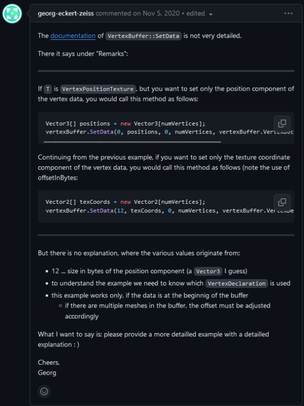
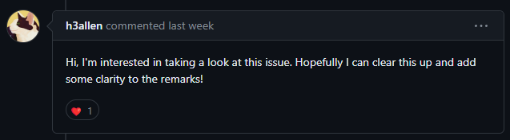
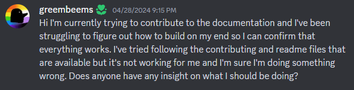
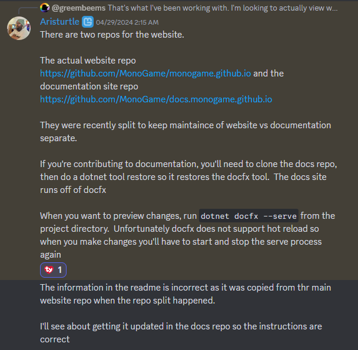

## What is MonoGame?
[MonoGame](https://monogame.net/) is an open source game API based on Microsoft's XNA system. It can be used to create both 2D and 3D games, although the vast majority are in 2D. Recently, MonoGame has been updating their documentation as well as moving it to a new repo for better organization. They've been used to create a number of well-known games (although some have later transferred to other engines) and IGM uses MonoGame in IGME 106 for the long-term game project.

## Community Evaluation
I worked with MonoGame for my bug fix. While I had a few issues with their maintainers not being the most communicative, they were managing some high-level bounties at the time and transferring their documentation over to an entirely new repo, so it was understandable that I wasn't exactly a high priority. 

The guy who originally posted about this documentation issue way back in 2020 actually reacted to my desire to fix it! I was surprised he was even still paying attention to it at this point and it was nice to receive a positive reaction from a member of the community directly involved in the problem.

## The Issue
The issue I chose to solve is [Issue #7396 - [Doc] Incomplete VertexBuffer documentation](https://github.com/MonoGame/MonoGame/issues/7396). I picked a documentation issue mostly as I’ve been hearing complaints about the lack of clear documentation in MonoGame. I also personally dislike the lack of clarity in a lot of MonoGame documentation and how you mostly just have to figure out what to do entirely on your own. This particular issue was using magic numbers in an example, with no explanation as to how those values came about. While it's a useful guide for the one buffer they're displaying, that example is useless if you're working with any other buffer MonoGame provides.

The issue has also been up since 2020, so either no one has bothered to fix it, or no one’s made an adequate change to the documentation that actually clarifies the SetData method. 
The issue appeared to be something I could solve with a little bit of effort and would mostly rely on me figuring out how MonoGame's documentation system works. I have experience with handling (and screwing up) vertex buffers, so it was something well within my wheelhouse. The biggest task was actually finding what the docs were describing and working through what the code actually did.

The same two maintainers I saw on my bug fix have also interacted with this issue organizationally. It’s gone from being a milestone for 3.8.1 to just an item on a To Do list for documentation. From the looks of it, despite MonoGame listing on their website that they swap maintainers monthly, these two will continue to be managing the repos for the time being.

I commented on the issue thread and started the process of improving the lack of documentation.

### Searching for the Source of the Docs
The biggest initial hurdle was figuring out where MonoGame actually stores their documentation. After doing a little digging and finding a single issue post that mentioned the way MonoGame handles documentation in passing (which is… a bad sign), I found that MonoGame creates their docs from… the XML headers in their code… Which is, in my opinion, an interesting choice. It makes the comments within the code unwieldy, especially the examples. It also explains why most users I know complain about how insufficient and difficult to understand the MonoGame documentation is.

This is what the raw version of MonoGame documentation looks like. It’s difficult to read and more than a little unwieldy.

/// 

/// Sets the vertex buffer data, specifying the index at which to start copying from the source data array,
/// the number of elements to copy from the source data array, 
/// and how far apart elements from the source data array should be when they are copied into the vertex buffer.
/// 

/// <typeparam name="T">Type of elements in the data array.</typeparam>
/// <param name="offsetInBytes">Offset in bytes from the beginning of the vertex buffer to the start of the copied data.</param>
/// <param name="data">Data array.</param>
/// <param name="startIndex">Index at which to start copying from <paramref name="data"/>.
/// Must be within the <paramref name="data"/> array bounds.</param>
/// <param name="elementCount">Number of elements to copy from <paramref name="data"/>.
/// The combination of <paramref name="startIndex"/> and <paramref name="elementCount"/> 
/// must be within the <paramref name="data"/> array bounds.</param>
/// <param name="vertexStride">Specifies how far apart, in bytes, elements from <paramref name="data"/> should be when 
/// they are copied into the vertex buffer.
/// In almost all cases this should be <c>sizeof(T)</c>, to create a tightly-packed vertex buffer.
/// If you specify <c>sizeof(T)</c>, elements from <paramref name="data"/> will be copied into the 
/// vertex buffer with no padding between each element.
/// If you specify a value greater than <c>sizeof(T)</c>, elements from <paramref name="data"/> will be copied 
/// into the vertex buffer with padding between each element.
/// If you specify <c>0</c> for this parameter, it will be treated as if you had specified <c>sizeof(T)</c>.
/// With the exception of <c>0</c>, you must specify a value greater than or equal to <c>sizeof(T)</c>.</param>
/// <remarks>
/// If <c>T</c> is <c>VertexPositionTexture</c>, but you want to set only the position component of the vertex data,
/// you would call this method as follows:
/// <code>
/// Vector3[] positions = new Vector3[numVertices];
/// vertexBuffer.SetData(0, positions, 0, numVertices, vertexBuffer.VertexDeclaration.VertexStride);
/// </code>
/// 
/// Continuing from the previous example, if you want to set only the texture coordinate component of the vertex data,
/// you would call this method as follows (note the use of <paramref name="offsetInBytes"/>:
/// <code>
/// Vector2[] texCoords = new Vector2[numVertices];
/// vertexBuffer.SetData(12, texCoords, 0, numVertices, vertexBuffer.VertexDeclaration.VertexStride);
/// </code>
/// </remarks>
/// <remarks>
/// If you provide a <c>byte[]</c> in the <paramref name="data"/> parameter, then you should almost certainly
/// set <paramref name="vertexStride"/> to <c>1</c>, to avoid leaving any padding between the <c>byte</c> values
/// when they are copied into the vertex buffer.
/// </remarks>


This also wasn’t the only comment I had to handle. SetData has 2 overloads who also have their own unique comments. It ends up looking something like [this](https://docs.monogame.net/api/Microsoft.Xna.Framework.Graphics.VertexBuffer.html#Microsoft_Xna_Framework_Graphics_VertexBuffer_SetData__1_System_Int32___0___System_Int32_System_Int32_System_Int32_).

I slapped the comments into a text file and removed most of the formatting. I then had each "paragraph" in its own section, making it much easier to read and therefore edit. I noticed at this stage that the original docs author missed a couple pieces of punctuation, so I decided to add those while I was adding clarity as well.

### Finding the Source of the Values
The bulk of the work on this issue was going to be finding where the values 0 and 12 come from in the samples. They’re listed as offsets for the parameters, but in the documentation, it’s just a magic number with no explanation. The biggest issue was actually finding where these numbers came from. Based on the issue’s comment, and my own knowledge of buffers, 0 and 12 are the offsets that represent 2 given pieces of data: 0 is the offset for the position since position is first in the buffer and 12 is something after that, which we can intuit to be the size of the Vector3 data type used by the position. Understandably though, intuiting and assuming the reason behind a value isn’t all that helpful. We can assume it’s the right answer, but without confirmation, that information isn’t actually meaningful for a user.

Thus begins my journey into MonoGame’s multiple different files and directories that MIGHT have the information I’m looking for.

The biggest problem in searching through these files is that the Vertex Buffer directory alone has 23 files. Add the additional 4 files in the Shader directory that ideally should have a reference to the Vertex Buffer and you get 27 total files I have to search through. I started with the most logical: VertexBuffer.cs. 

The reasoning behind these 23 files for the Vertex buffer is that each file is only a partial class or struct. Each file contained something along these lines:


/// 

/// Defines a single element in a vertex.
/// 

public partial struct VertexElement : IEquatable<VertexElement>

/// 

/// Represents a list of 3D vertices to be streamed to the graphics device.
/// 

public partial class VertexBuffer : GraphicsResource


After finding the struct (it was mentioned in the docs but not linked), the actual fix was fairly easy. 0 occurs as the position is the first piece of data in the buffer, so it needs no offset. 12 ends up being the size of the position's vector 3, which makes sense since you'll need to offset that amount to access the next chunk of data in the buffer. These have to be literals because the size of these vectors isn't something you can check using the sizeof() function. Adding that context to the docs (and linking the buffer they come from instead of just mentioning it's name) is all that's really needed for this to be more helpful for and end user. The rest of the docs had already been looked over by another contributor to better clarify the rest of the methods, Set Data had just been avoided.

### Attempting to Build
In order to build docs to check them, you need to:
1. Have or download .NET SDK 6.0 or higher
2. Have or download Node.js and NPM
3. Update the MonoGame submodule in the External folder of the project
4. Follow the instructions in the site readme for preparing your environment and generating the documentation.
5. “Follow the instructions in the site readme for preparing your environment and generating the documentation.” THEY DO NOT LINK THIS!!
6. “Use the npm run articles command to finally generate the site to only check the documentation updates (although it may be easier to simply run npm run dev to generate everything)”
7. Use the npm run dev command to generate the site

There's a variety of instructions that approximately follow these steps with minor changes to commands and where you need to run them in a variety of different locations from official documentation to README's in repos. Some of the links in the docs and README's are also dead, making it even harder to find the answer.

After attempting for a few hours and asking Silas for some help since they'd done it before, It was time to ask for some help from the community. We'd managed to get the MonoGame home page to generate, but it linked back to the live docs, not the local source I'd provided.

### Asking for Help
Since I couldn't figure out how to actually generate the documentation I needed, it was time to head into MonoGame's Discord server and ask for an answer. Allegedly there were other people in there that could lend me a hand as they'd been helping with the documentation as well.

The first person to respond told me where documentation was gereated from, the XML comments. That wasn't all too helpful since I'd already figured that out several days prior. They admitted they actually didn't know all that much about what I was trying to work on. 

Luckily, one of the moderators and long-time contributors, Aristurtle, responded with a detailed guide and links for what I needed. They'd also responded on my last PR about some changes I could make to improve what I'd proposed! He also mentioned giving the maintainers a heads up that the README in the documentation repo was wrong. Hopefully that change happens soon so they're not getting asked again.

Overall, the community is fairly active with helping one another (someone even had a bingo card dedicated to FAQ's in the help channel). MonoGame user and contributor help seems to all be housed in one place, which was interesting. In the middle of me asking for help with docs, another user asked for help with physics collisions.

## Pull Request
My Pull Request can be found [here](https://github.com/MonoGame/MonoGame/pull/8294). There hasn't been any activity on it since I put it up, but the maintainers tend to do work during the week in the early morning, so I'm not expecting to see anything anytime soon.

## Conclusion
Overall, the experience was pretty similar to that of my bug fix. The maintainers didn't respond to my PR and given that there's higher-priority tasks going on right now, that's fine by me. I asked the community for assistance this time and did actually end up getting some help out of that after about a day or so. 

My only real issue at this stage is how MonoGame handles its documentation. While using XML comments is a great idea in theory to keep everything synced, it isn't the most editor-friendly and I'm sure more than a few would-be contributors have seen the walls of comments and balked at the task. 