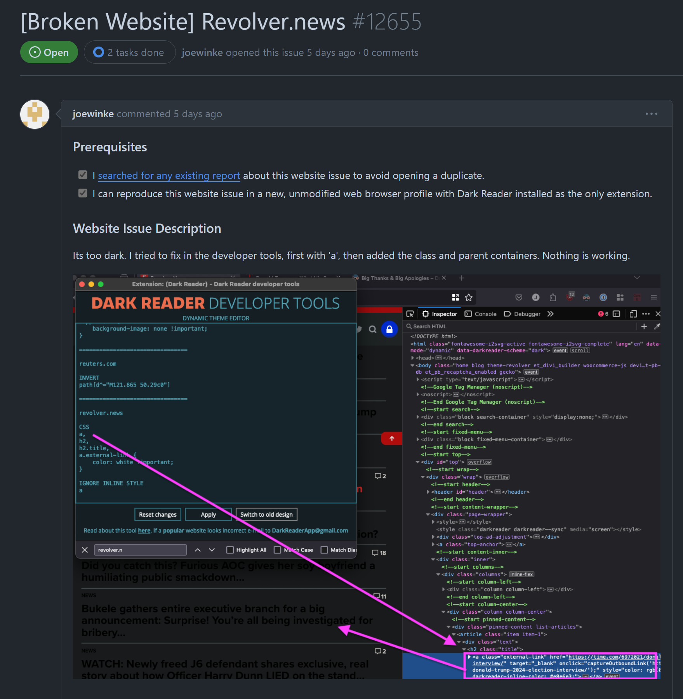
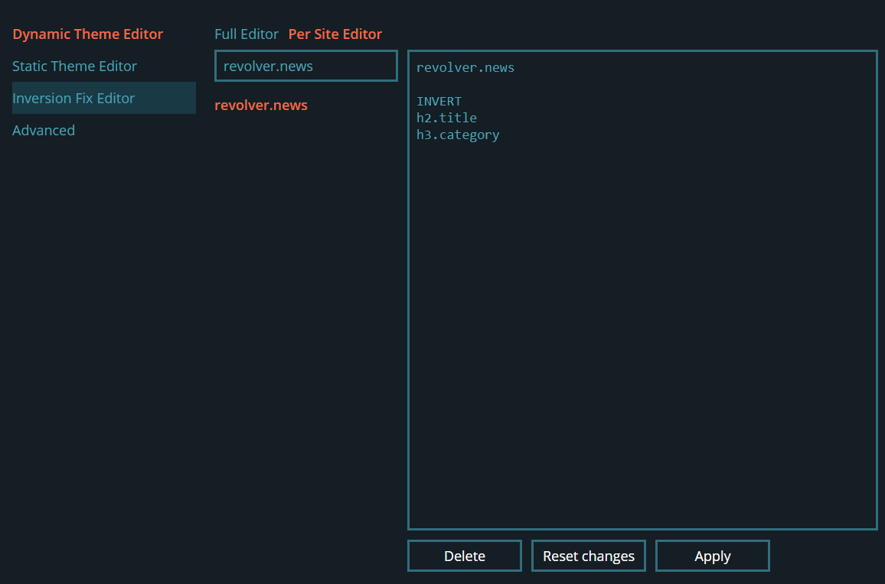
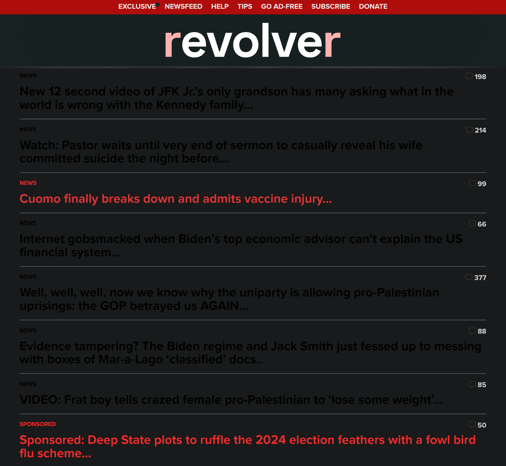
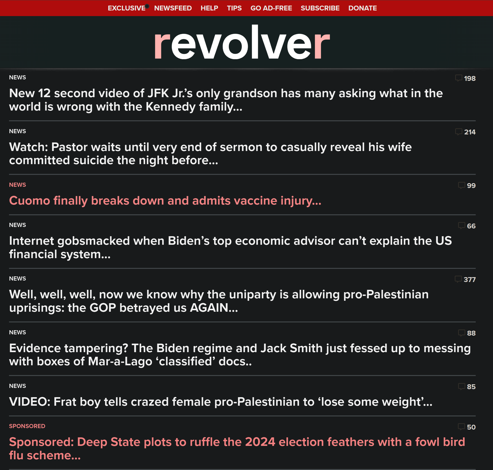
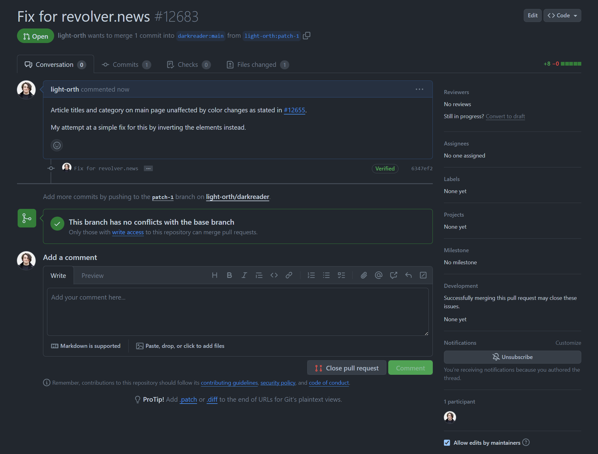

## The Community

### What is Dark Reader?
Dark Reader is a open-source web browser extension, primary for Chrome and Firefox-based browser. The main purpose of the extension is to apply a 'dark theme' to websites that usually do not, in order to provide a page that's easier on the eyes for users browsing in dark environments. It does this by dynamically augmenting the page's CSS, changing the color of elements (making the background dark and text light for example), and/or by inverting the color of elements (usually images). Additionally, Dark Reader applies community written fixes when the "Dynamic Mode" doesn't get everything right.

### Why this project?
I chose Dark Reader for a few different reasons. Firstly, it's a project that I now personally use, after hearing about it for a few years I was finally prompted to use it after the Comm Arch presentation done it class, and have been very pleased with it. Additionally, after spending a lot of time looking for projects that I could effectively contribute to (as many were beyond the scope of my skills), the large amount of issues on their GitHub page and relatively low complexity seemed like a good first-issue for me to tackle.

### What I learned from Comm Arch
Since this project was one of the specifically communities covered, I was able to learn about it then. But more generally speaking, I was able to determine that this was a good project to work on based on a number of different factors. Firstly, the community is very active in regards to both users and contributors, with contributions and new issues appearing nearly daily. Additionally, the project has good resources and documentation to help users get started.

### Existing Resources
There were a few different provided rules and tools to help me get started. Firstly, theres a very throughough contribution docs files that outlines how to go about making site-specific fixes, and as well as how to added those contributions to the community's. The secondly resource I found valuable, was the Dark Reader 'dev tools' provided in the extension, which allows you to make edits and try your fix before attempting to merge it with the main.

## The Issue
The issue I chose was for a broken website, and after some browser over a couple days I found issue #12655, for the website revolver.news and decided it was a good fit. On the main page of the site, the titles of the articles had a color that was very similar to that of the background, making them diffucult to read. joewinke, the user who opened the issue, had already tried to fix it themselves using the dev tools, but was unsucessful.

## The Fix

When I first started diving into the issue using the dark reader and chrome dev tools, I ran into the same issue as joewinke, in which my selected elements were not accepting my new color changes which I spent a fair amount of time attempting to work past, investigating deeper into the existing CSS. But in the end I opted to simply invert the color of the text elements that were causing me issues.

### Result

revolver.news before

revolver.news after

## Adoption

I created my Pull Request and as of now (May 5th, 2024), it is still curently open and pending.

## Conclusion

Overally, this process honestly made me very anxious. I hard a very hard time looking for projects to contribute to, especially those that would fit well with my software background. Additionally, I felt a lot of nervousness from my work being judged and seen by others. However, despite that I still think it was a very valuable experience, and something that I will only get better at and more comfortable with time. Additionally, I really enjoy working within the Dark Reader community and would do so again in the future. Feel free to check out the [orignal issue](https://github.com/darkreader/darkreader/issues/12655), and [my PR](https://github.com/darkreader/darkreader/pull/12683).