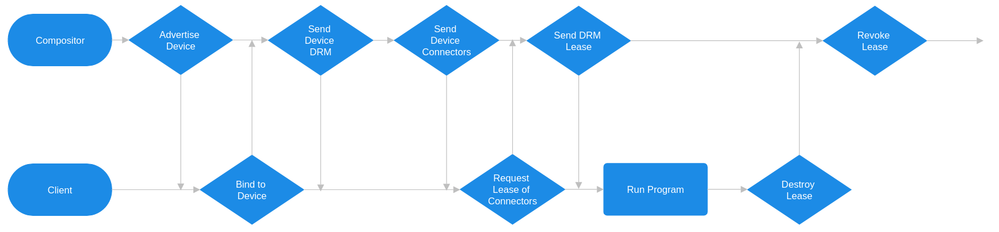

# What is Mutter?
[Project Website](https://www.gnome.org)
[GitLab Page](https://gitlab.gnome.org/GNOME/mutter)

Mutter is the display server used by the GNOME desktop environment. It handles all of the window management and compositing needed for a desktop environment. Together the GNOME shell and mutter are responsible for the desktop experience, with the shell handling user interaction and calling mutter for all the backend work.

# What is DRM leasing?
[DRM leases presentation](https://www.x.org/wiki/Events/XDC2017/packard_drm_lease.pdf)
The DRM (Direct Rendering Manager) subsystem of linux is responsible for managing everything to do with graphics drivers on Linux. One capability of the DRM subsystem is the creation of a DRM lease. This lease gives the lessee total control over the subset of DRM resources included in the lease. The primary purpose of a DRM lease (at the present) is for virtual reality applications. The tight latency requirements involved in virtual reality necessitate the VR compositor having total control over the VR display (which is what is leased out) to time everything as tightly as possible.

## The DRM lease wayland protocol
[DRM lease wayland protocol](https://wayland.app/protocols/drm-lease-v1)
Under XOrg any application could access the DRM master, and create a DRM lease for itself from it. Under Wayland this is not possible as the Wayland compositor takes total control of the DRM master during initialization. This means that a DRM lease needs to be created by the compositor and handed off to the application instead. This kind of capability is handled via Wayland protocols, optional extensions that each Wayland compositor must implement if an application needs to use it. For the DRM lease protocol specifically, a list of available non-desktop displays is advertised to the client application that then chooses the most adequate one and requests a lease for it from the compositor. If the lease request is granted then the compositor creates the lease and passes the leased DRM file descriptor back to the client.

# The Issue
The necessary evil of wayland protocols is that each compositor needs to implement each one, and due to the totally different internal structure of different compositors very little from each implmentation can be shared. While many other compositors, namely KWin (KDE's compositor), Sway, and Hyprland have implemented the DRM lease protocol already, Mutter has not. Due to the extreme rarity of virtual reality users, especially ones that use GNOME there has not been a huge drive to get an implementation merged. I happen to be one of those lucky few users, and so I decided to take a crack at it.

# The Process
## In the beginning...
There were several prior attempts at implementing the protocol before mine. Almost 3 years ago Jonas Ådahl (A GNOME maintainer) began [working on an implementation](https://gitlab.gnome.org/jadahl/mutter/-/commits/wip/wayland-drm-lease/) but never finished it. About a year after his work ceased Hunor Csomortáni (contributor) took up the reigns, rebasing it and [continuing the work](https://gitlab.gnome.org/GNOME/mutter/-/merge_requests/2759), but again never got around to finishing it. 8 months ago Dallas Strouse decided to [try finishing it](https://gitlab.gnome.org/GNOME/mutter/-/merge_requests/3205) which is when I first got involved, [offering to test](https://gitlab.gnome.org/GNOME/mutter/-/merge_requests/3205#note_1825909) it as they did not own a VR headset to test with. Unfortunatly work eventually ceased due to many disagreements popping up in the [original issue](https://gitlab.gnome.org/GNOME/mutter/-/issues/1743). Because of those disagreements Sebastian Wick (GNOME developer) decided to attempt his own [implementation](https://gitlab.gnome.org/GNOME/mutter/-/merge_requests/3331) of DRM leasing, this time through a D-Bus service instead of a Wayland protocol. He would go on to flush out the lease backend, making the D-Bus service essentially a wrapper around it. Around the same time I decided to [try working on](https://gitlab.gnome.org/bbatson/mutter/-/tree/og-drm-leasing) the Wayland protocol implementation. I was able to hack on it until it worked, but it clearly still needed a lot of work which I did not have the time for.

## Initial Attempt
When I first attempted an implementation (base off of Dallas Strouse's work) I needed to teach myself everything. Hacking on mutter requires knowledge of the mutter internals, knowledge of GLib/GObject, and knowlege of the wayland library, none of which I had before starting to work on this project. Luckily I most of the backend work was already done, and those only thing I had to implement there was rewrite a function to get the CRTC (Cathode Ray Tube Controller, (name is the relic of the past but basically the controller for a display output) from the DRM device. To learn the control flow of the Wayland protocol I set the `WAYLAND_DEBUG` environment variable before running SteamVR after switching to a compositor that supported the protocol (Sway), which provided a debug printout of all the Wayland protocol events. The DRM lease specific output is here:
```
[ 763564.313] wl_registry@2.global(32, "wp_drm_lease_device_v1", 1)
[ 763564.315]  -> wl_registry@2.bind(32, "wp_drm_lease_device_v1", 1, new id [unknown]@3)
[ 763564.320]  -> wl_display@1.sync(new id wl_callback@4)
[ 763586.314] wl_display@1.delete_id(4)
[ 763586.322] wp_drm_lease_device_v1@3.drm_fd(fd 4)
[ 763586.336] wp_drm_lease_device_v1@3.connector(new id wp_drm_lease_connector_v1@4278190080)
[ 763586.347] wp_drm_lease_connector_v1@4278190080.name("DP-2")
[ 763586.354] wp_drm_lease_connector_v1@4278190080.description("VLV 37288 Index HMD")
[ 763586.360] wp_drm_lease_connector_v1@4278190080.connector_id(101)
[ 763586.367] wp_drm_lease_connector_v1@4278190080.done()
[ 763586.373] wp_drm_lease_device_v1@3.done()
[ 763586.379] wl_callback@4.done(461)
[ 763586.390]  -> wp_drm_lease_device_v1@3.create_lease_request(new id wp_drm_lease_request_v1@4)
[ 763586.398]  -> wp_drm_lease_request_v1@4.request_connector(wp_drm_lease_connector_v1@4278190080)
[ 763586.405]  -> wp_drm_lease_request_v1@4.submit(new id wp_drm_lease_v1@5)
[ 763588.434] wp_drm_lease_v1@5.lease_fd(fd 4)
```
This can be difficult to look at so I created a simplified flowchart here:


The last hurdle was learning to use GLib/GObject, but that turned out to be fairly easy as it has great [documentation](https://docs.gtk.org/glib/), and I ended up really enjoying using it.

With some fairly minor edits I was able to hack at the Wayland protocol implementation until the SteamVR error message about not having the DRM lease protocol subsided... but I was struck by a different issue:

It turns out that just before I started working on the implementation Valve had launch version 2.0 of SteamVR, and some things were broken on Linux. Joshua Ashton (Valve) notified me that That meant I had to find a new way to test my implementation, which led me to [kmscube](https://gitlab.freedesktop.org/mesa/kmscube).

Kmscube is an example bare metal graphics demo application (as in it directly outputs to the connected display). The only problem is that it did not have a DRM lease protocol implementation, so I would have to implement it myself. I was able to add a few command line options to select that the DRM file descriptor should come from a lease, and then I just had to [write the Wayland client implementation](https://gitlab.freedesktop.org/bbatson/kmscube/-/tree/drm-leasing). Luckily after writing the server implementation I was pretty comfortable with the protocol, and my implementation did not have to be robust. Just leasing the first available connector would be enough. So I completed my barebones implementation and tested it first on Sway to ensure it would work with an existing protocol implementation, then with my modified mutter to check my implementation. Luckily it worked essentially first try, and I had graphics!

(This is a picture of kmscube running in the headset, kmscube makes a spinning rainbow cube you can see the corner of it in this image)

There were some bugs like the wrong CRTC being chosen but I was able to iron everything out before long and got a functioning, if very janky, implementation. I submitted my changes as a [merge request](https://gitlab.gnome.org/orowith2os/mutter/-/merge_requests/1) to Dallas Strouse's branch, but due to all the disagreements happening in the main issue they closed their branch and I did not have time to follow up so things just sat dormant for a while.

## Back on track
This assignment provided me with a good opportunity to get back to work on this project. Together with what I saw as a request for an implementation by the maintainters in the [issue](https://gitlab.gnome.org/GNOME/mutter/-/issues/1743#note_2085317), I decided to try working on it again. For this iteration I was able to base my work off of what Sebastian Wick had done, so all of the actual leasing logic was abstracted away and I just had to replace his D-Bus frontend with a Wayland protocol front end. I did run into some conflicts trying to rebase his work on top of the 46.1 tag, which led me to learn how to actually do rebases and resolve conflicts. The 46.1 tag was used as that was the latest version that I could rebase onto that I could fairly easily patch my system install with (Gentoo is still stuck on GNOME 45.5, but I only had to bump mutter and gnome-shell to 46.1). I was able to use the old DRM lease protocol frontend as a guide, but I ended up rewriting most of it for this most recent iteration to get a cleaner and more memory safe flow. Essentially a DRM lease manager is created, connected to the KMS lease manager Sebastian Wick created in the backend. That KMS lease manager would send events whenever connectors changed which the DRM lease manager would respond to by updating the broadcasted list of devices/connectors. Simplifying a lot, the manager keeps a hash table of devices, and each device keeps a hash table of lists of connectors for each client that binds to it. Then when the lease request is made all the connectors requested are passed in a list to the KMS lease manager which creates the lease, from which the file descriptor can be sent to the client. I once again used my modified kmscube to check that it was working right. After 30+ small fixes (lots of memory I forgot about) I got it to work properly (and even handle hot unplugging of the headset). Then I moved on to testing with SteamVR and was pleased to see that everything worked right there too.

While this implementation is probably missing some edge cases I decided it was good enough for a [draft MR](https://gitlab.gnome.org/GNOME/mutter/-/merge_requests/3739) so I can get some feedback on it.

# Conclusion
Mutter is definitly one of the more difficult projects to work on. There is a lot of specialized knowledge needed to work on it, and for something used so widely the code quality has to be top notch. While I personally feel that as this is the current standard for virtual reality and shares fairly broad support that mutter should implement support ASAP as well, I do acknowledge the concerns some people raised in the main issue about wanting a more complete virtual reality interface for Linux. This protocol is kind of a hack as is the rest of VR on linux, requiring administrative privliges to even set up. One idea that has been brought up (though has plenty of it's own concerns, not to mention requiring a complete restructuring of Linux desktop environments) is to implement this functionality in [systemd-logind](https://github.com/systemd/systemd/issues/29078). But again as if this is even feasible at all, it certaintly is not in the short term I believe that implementing this protocol now is the most prudent decision.

As of right now there has not been a response to my merge request draft, though I am not surprised given this is a weekend and working on this is some of the involved individual's jobs. I hope to get feedback on changes that need to be made for the implementation to be more correct, and to implement them before long. The GNOME 47 release is 5 months away, and I hope to have this protocol land in mutter before then.
