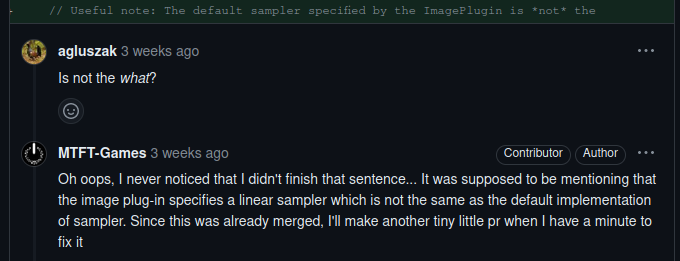
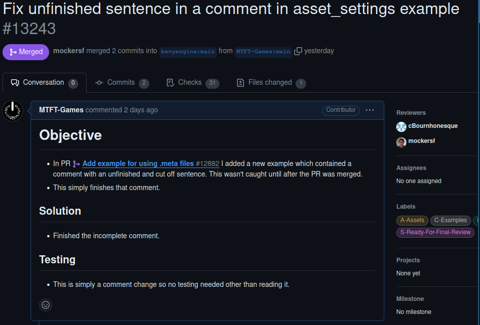
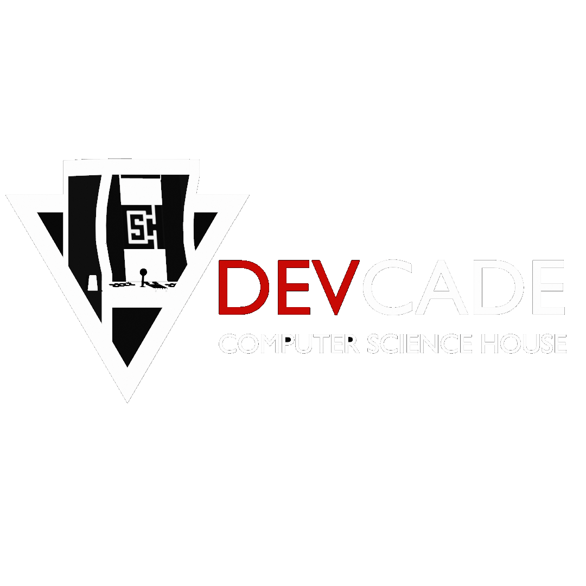
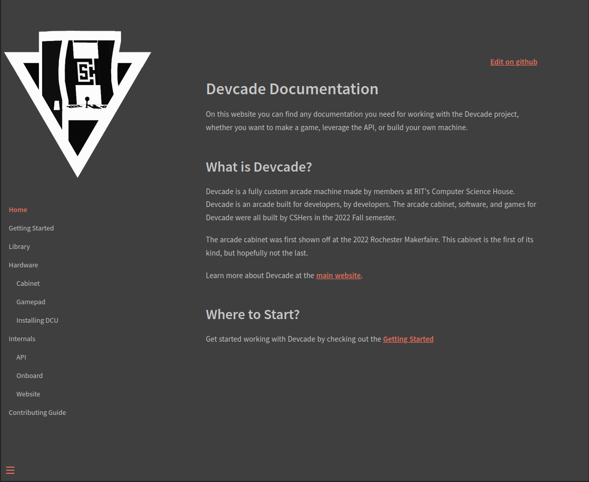
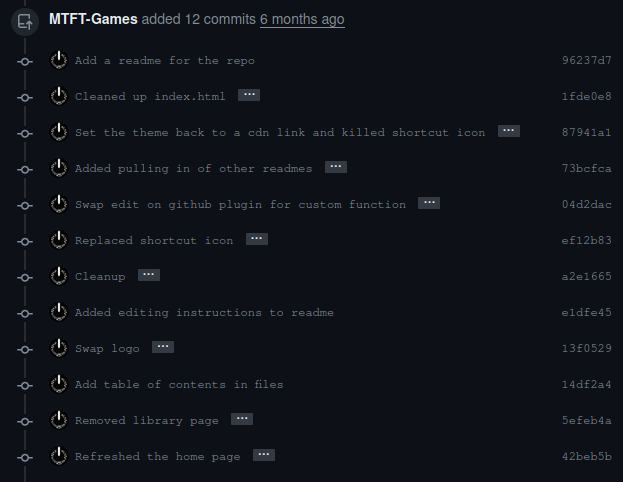
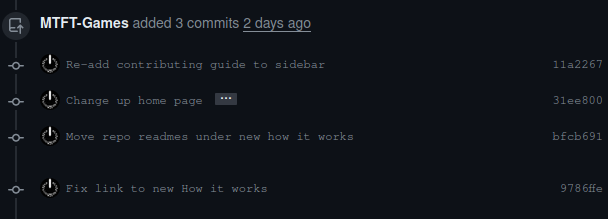
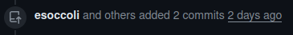
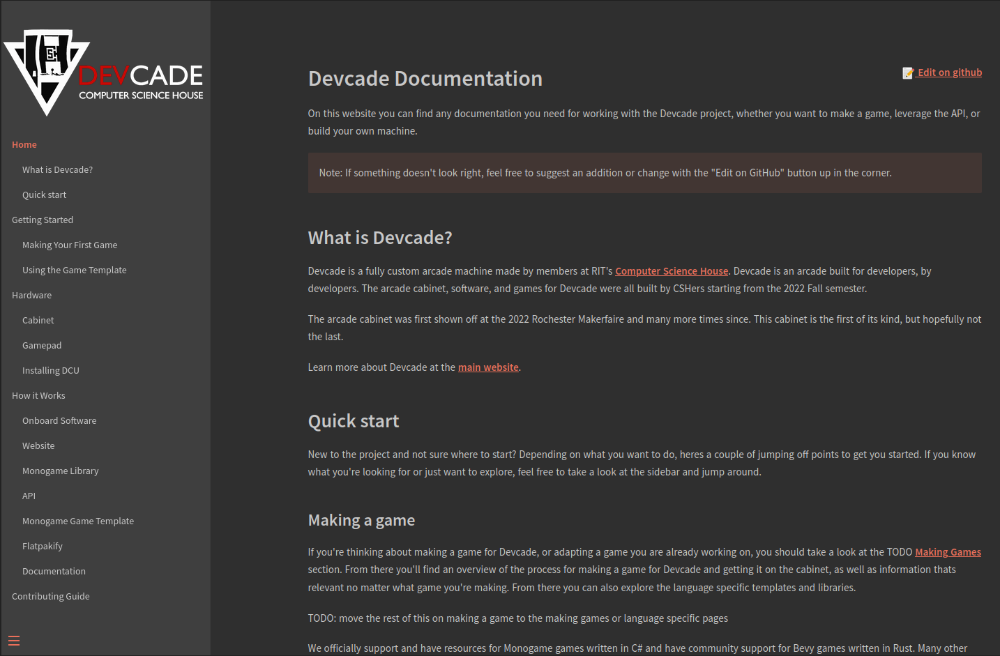

# Fixing the last one

During the last bug fix, it turns out I actually added a small issue in with my changes. Since it wasn't noticed until after the bugfix was already merged: 

This was a simple, trivial, and small fix that got done and merged as soon as i sat down to do it but I thought I would include it anyway:

# Devcade

[Devcade](https://devcade.csh.rit.edu) is a free and open source game platform and arcade cabinet build by Computer Science House here at RIT. I picked it as a community to contribute to because I have a heavy interest in the project, I am actually (until I graduate in less than a week) project lead, and I have already been working on this particular contribution for a while. 

While my first Comm Arch experience covered this project in a less than positive light but several factors indicated that this would still be good to work with. The project is in active development and quite young so I feel I can excuse some of the missed points on the Comm Arch, the process for contributing is fairly straightforward, and I am already very involved in the project, knowing how things have improved since the Comm Arch and the inner workings.

Resources that I looked at for this contribution primarily included the existing [documentation site](https://devcade.csh.rit.edu/docs).

## Full Refresh and Overhaul of Docs Site

There isn't an issue relating to the contributions I'm making but, none the less, they are very necessary. I picked it though because it is an area sorely needing work, especially as we plan to make the project much more public within RIT, and I have been on and off working on this very large PR for a while already. I went about doing this by simply making a [branch](https://github.com/ComputerScienceHouse/devcade-docs/tree/docs-refresh) and a draft [PR](https://github.com/ComputerScienceHouse/devcade-docs/pull/6) with a list of goals I wanted to accomplish. From there I just worked away at it in no organized fashion over time.

several commits later...

For most of the time I've been working on this, nothing of note happened other than the progress I was making. Recently, another community member began making some commits to my branch to help work on it but thats about it.

There wasn't much of anything blocking this from getting done other than the fact that it is a large overhaul of a section of the project. The standard other schoolwork, free time, and distractions are also always issues. Due to a combination of these, it isn't merged yet but it is well on its way to getting merged and should be quite easy to get merged.

