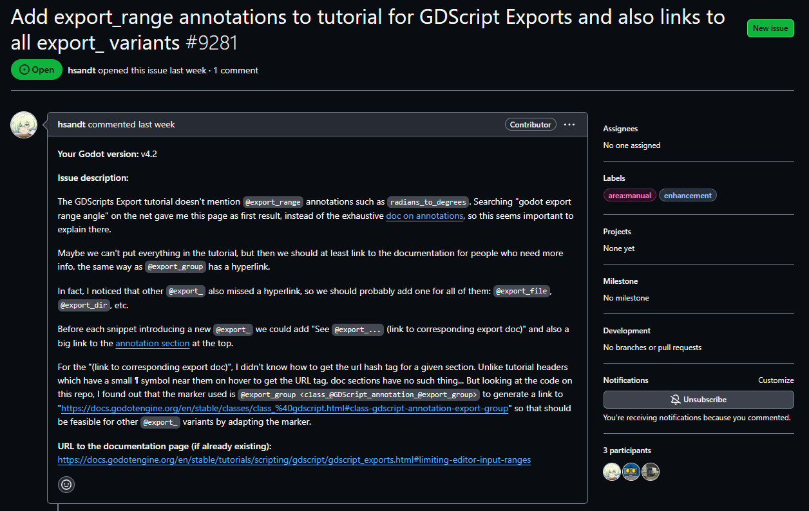
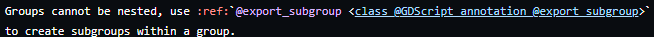
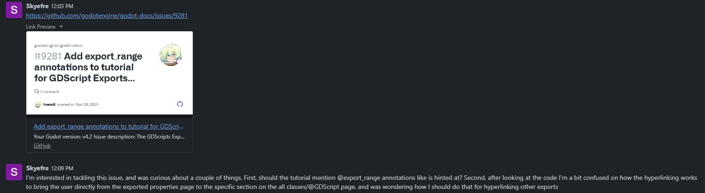
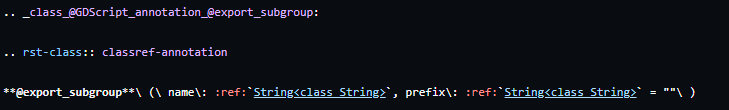
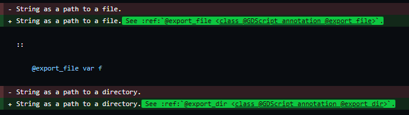
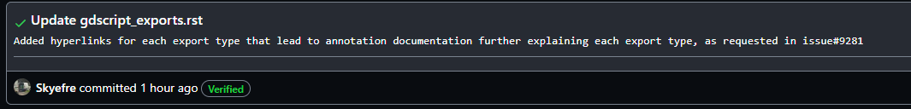

## What is Godot?
Godot is an open-source game development engine that is maintained by a small group of people who oversee and approve all issues and pull requests. Godot uses its own unique language called GDScript, which is similar to Python, but it also supports c# usage with the .net version. It has come more into the spotlight recently with Unity's monetization changes this past fall.

## Why stick with Godot?
I chose to stick with Godot for my contribution for a couple reasons. Firstly, I am now familiar with their work flow after doing my bug-fix with Godot, so I didn't have to learn a new work flow with a different project. Secondly, I personally use and love Godot, and there are plenty of QoL changes to be made for a better overall user experience.

## The Issue
For my contribution, I wanted to contribute something much more substantial to the lacking godot documentation. Since I naturally forgot every problem I've ever had looking through the documentation for something specific, I began combing through the issues. Eventually I came across the issue below, and it really resonated with me. Exports in Godot are extremely useful as they allow you to change variable values in the inspector, but there are so many kinds it can get confusing.

## Beginning the Contribution

I began my contribution with a bit of research. There were several things that I needed to find, those being the page I needed to change and the page I needed to link to (both of which were linked in the issue). I then had to figure out where in the GitHub these pages were which is surely an easy task right? No quite. The godot-docs have a lot of pages and a lot of folders so that everything is well organized, but it also makes looking for things a nightmare.

The page that I was looking to make changes to, the exports page, I found pretty quickly. I checked the website, saw that it was in the scripting part of the tutorials section. Assuming that I could find it in the same place, I went there in the GitHub and there it was! Surely the other page I'm looking for makes sense as well!

This page was a fair bit harder to find. On the website it's under a section called classes, and in the "how to contribute" portion of the documentation, it mentions that class related things are actually held in the godot-engine repo, and NOT the godot-docs one. This led me astray, as I assumed that since it was under classes it would be in godot-engine, which it was not. After that, I had one more problem I had to solve: how do I link these pages, and how do I link to a specific part of a page?

As there was already one link to another page in there, I was able to base my understanding of how to link to a page using that, but I still didn't understand how it was directing to a specific portion of the page. Using my knowledge from my bug-fix, I knew that there was a Godot contributors forum where I was told I could get answers to my questions, so I tried asking there.

After sending that message, I waited a full day, seeing other people putting questions about certain issues into there as well. By the time 3-4 days had passed, I noticed that not a single person had gotten an answer to any of their questions, which I thought was odd given that I was told to ask there. Seeing no hope in that route, I decided I had to figure it out myself.

After taking a look at the reference to the other page further up in this blog, I began scrolling through the code of the page I was linking to, trying to find anything that match the linking code so I could hopefully figure out how it works. Eventually, I found the above image, with the important part being the pink ".. _class_@GDScript_annotation_@export_subgroup:" at the top. I realized that each section of this page had it's own class link like that, and that's how I could link everything.

## The Contribution

It was finally time for the actual contribution. I began with linking just a couple of the @export_ declarations to their respective page so that I could make sure I was doing it correctly before doing all of them. It was impossible for me to test on my own branch as the changes needed to actually be applied to the site for me to tell.

After waiting for a little bit, I eventually received confirmation that my pull request was merged to main, and upon checking, I discovered that the new links worked! Immediately I began to comb through the rest of the page, carefully linking each section on the exports tutorial page to its appropriate section in the annotations page. As the code is too long, I don't have a picture to put here.

## Conclusion

After going through the long and lengthy process that was figuring everything out on my own, it was time to make my final pull request. After making the final commit and request, I then went back to the original issue and left a comment, informing that I had resolved the issue as best I could and linked the pull request.

At the time of writing this, I am still waiting for my final pull request to be looked over and either approved or denied. Overall, contributing to something that I personally enjoy using has been a rewarding experience, and I'm glad that I could be of some help to the Godot community, especially those just starting.