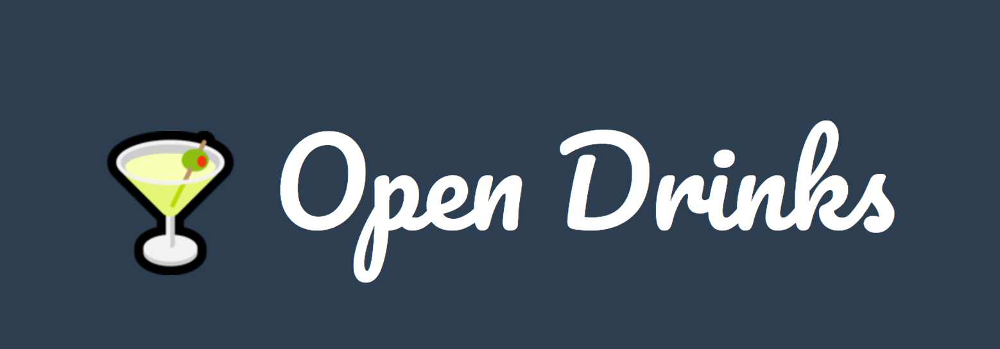

## Why did I change projects?

For my contribution I wanted to try doing something on a slightly larger scale, but that was still in the realm of my skills, as someone without a traditionaly software engineering background. I did my original bug fix for the Dark Reader extension, however most of the areas I could contribute to this project are on a pretty small scale. I did try to look into some larger-scale feature implementation for Dark Reader, but later I decided it would be better to move onto a different project.

## The Project

### What is Open Drinks?

Open Drinks is a open-source repository and website that catalogs user-submitted drink recipes, which can be then be browsed and searched for based on keywords. The project was created as part of Hacktoberfest 2019, and has maintained a somewhat active status since, additionally participating in Hacktoberfest 2020 and 2021. Users can contribute new recipes to the page by forking the repository, adding new .json files to the ../recipies folder, and then creating a new pull request to add it to the main site.

### Why did I choose it?

I decided to contribute to this project for a few different reasons. Firstly, when I initially learned about the project I found it generally interesting. One of my hobbies is mixology and experimenting with creating and trying different cocktail recipes, so this project really grabbed my interest. Secondly, as somewhat mentioned above, I wanted to pick something that would be suitible with my limited traditional software engineering skills, and would be easily achievable in my timeframe, and the drink recipe seemed like a good fit.

### What I Learned from Comm Arch

Coming from our comm arch presentations there were a few different things I looked at for this project, before deciding to contribute to it. Firstly was the contributions over time. The most recent contribution to the project was about 4 months ago on January 2nd, 2024 meaning that the project is not currently very active. However, looking at the total contributions there has been a consitent amount since the project was initially created with several large 4-6 months gaps, meaning it is not dead persay.

!image

I additonally looked into the project's releases and documentation. There were several different releases, each marking a different milestone of the Hacktoberfest of that year.

!image

There was also sufficent documentation, including code of conduct, contribution practices, and their license availible.

!image

### Existing Resources

As previously mentioned, there is a fair amount of help written resources for new users, primarily a 'Contributing.md' which outlines how to go about adding new recipies to the site, including an example/template of how to fill out a new one. Additional, the file also contains instructions on how to add new unit tests.

!image

## The Contribution

### What I Chose

For my contribution towards the project I decided to add the recipe of one my favorite drinks ever, that I had first tried a local reasturant in my hometown.

### How Does it Compare to my Bug Fix?

I think that both my bug fix and my contribution are largely similar in complexity as well as the general process, as they both primarily involved just making edits to text files. Futhermore, the process of creating the recipe contribution is very similar to the procress of creating these blog post, in which you create a fork of the repository, add a new file to the folder, and then create a pull request.

### How I Went About It

When writing my recipe contribution, I first found the original description of the drink off of the resturant's menu. Sicne this is only a description of the ingredients, with no quanities or directions, I then used similar drink recipes and procedures I either knew already or found online in order to create the final recipe.

!image

### The Code

With my recipe in hand, I created a fork of the original repository, created my new .json file and filled out my information and instructions, and added my image to the designated folder. Once I was done I created my pull request.

!image

### Adoption

As of today (May 6th, 2024) my pull request is still open and awaiting approval. Given the current state and activity of the project I imagine that it won't be resolved anytime soon, but I hope that when the maintainer returns to the project it will be accepted without issue.

!image

## Conclusion