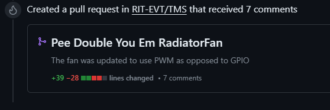
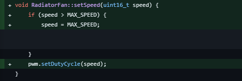
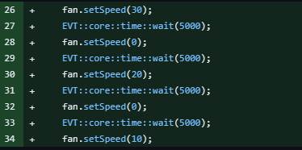

 

In my last blog post, I mentioned how being very early in my career, my personal experience has been characterized by a need to prove myself. In the Spring of 2023, a good chunk of my time was spent working on the RIT Electric Vehicle Team, and my previous blog post highlighted my very first pull request in the team's repo. It was pretty small, but it introduced me to the workflow on the team and helped me get going with tackling bigger tasks on the team.
In this entry, I'll dive into one of (if not the) greatest contribution I've made to the team thus far, as it actually ended up being used on the final electric bike (!); the REV1 (Road Electric Vehicle mark 1).

 
Figure 1: Summary clip of Final Contribution

 I chose this project having worked on the team for a while and possesing a pre-existing knowledge of the codebase. I didn't use my Comm Arch experience to determine whether it would be good to work with, however, I ran Caudron scan on the overall repo which I displayed in my previous post, and it is included here again, showing that the activity (during the school year since it is a school project) is pretty high and fairly stable.

 
Figure 2: Cauldron stat for RIT-EVT

## The Basis and Platform
The team builds and deploys electriv vehicles. That's what we do, and it takes a lot of people to get something that complex working in the real world. A plethora of constraints must be considered in order to ensure safe operation of the system. One of those considerations just so happens to be the thermals, which I was assigned to upgrade during this season.
As you would imagine the thermal constraints of an electric vehicle (A motorbike in this specific case) need to be operated such that we are not using more energy than we need to suring it's operation. To that end, my task was to assess the Thermal Management System (TMS) of the bike, and make changes such that the fans would have a wider range of operation rather than just an on or off state (GPIO).

## The Contribution
To give a fan a wider range of operation, you must consider first the nature of the device. Being that the fan is a rotary device, it is a member of the motor family. Motors can be operated in 2 ways: General Purpose Input-Output (GPIO) for ON-OFF operation, or Pulse Width Modulation (PWM) which allows you to quite literally alter the width of a single pulsation of voltage being sent to the device, to modulate the speed of the device accordingly. 

Because we wanted a wider range of operation speeds, I opted for PWM, which would save the fan from neccessarily operating at full wattage anytime it needed to be turned on.

 
Figure 3: Original state of `RadiatorFan()` constructor with (GPIO)

At a very rudimentary level, one would have to set up the microcontroller making use of the System Clock to load a value into a specific register responsible for the pulse width. However the natuere of the software stack on the team has it so that all preliminary operations are already set up, and PWM can be instantiated and even passed in as an argument to functions, simplifying the process of the upgrade.

As is generally standard practice, I referenced the HAL (Hardware Abstraction Layer - explained in my previous blog post to be a functionality wrapper) and changed the `RadiatorFan()` constructor from using GPIO to using PWM, and defaulting it to a zero speed as is seen in the `setDutyCycle(0)` portion of the initialization.

 
Figure 4: PWM implemented in `RadiatorFan()`

The next portion of the job was to implement a speed setting method using the `setDutyCycle()` method, which included a simple if statement such that if a number higher than the maximum speed (100% utilization) were entered, it would just set it to the maximum speed.

 
Figure 5: `setSpeed()` methofd for PWM fan control

## The Merge
Just like on any decently collaborative team, the team has a policy that 3 people must review the pull request before it can be merged. This was quickly achieved as the functionality could be verified on anybody's local machine. However, upon attempting testing, it was found that the change could not be tested because there was no sample program to test this new functionality. I got to work on that, and delivered a simple module to test setting the speed to different levels, with each number representing a duty cycle.

 
Figure 6: Code snippet of fan sample program for testing

## Conclusion

This was a fairly satisfactory contribution experience in a collaborative environment that actually captures my interests. Seeing my code be a part on an eventual final product was a peak experience of mine as an Electric Vehicle Team member. It encompassed what I expect to encounter in the real world, developing embedded software in industry and even for my own hobby's sake. Once again, it is important to seek help and listen attentively to gain insights on whatever you are working on, and you are bound to feel a sense of accomplishment upon completion of your task.

