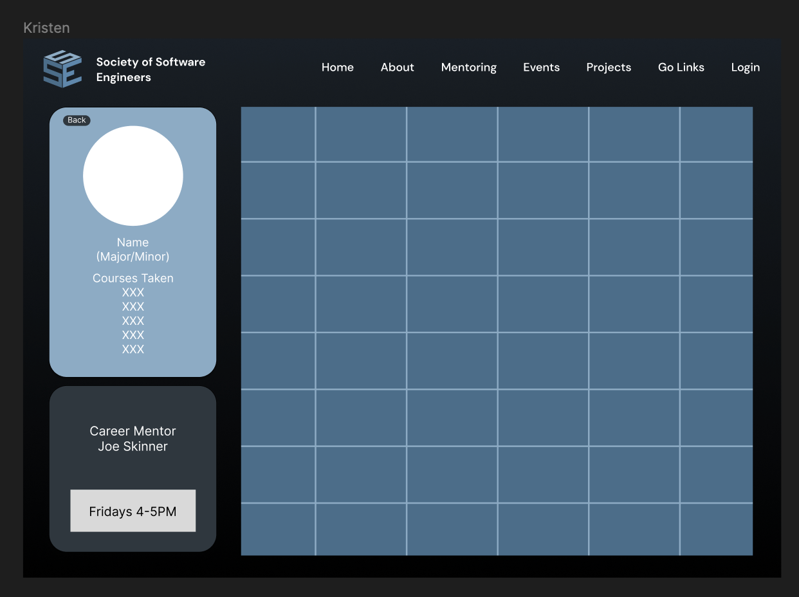

For my contribution, I decided to join the design team at the Society of Software Engineers for helping to build their revamped website. I decided to do this because I saw that they added a bunch of spots for a whole design team, and wanted to help out if I could.

To contribute to this open source project/club, I went in person to their Sunday 1pm meetings. At the meetings we were mainly focuesd on:
- Thinking of how to take into account user experience
- Including all of the features that were asked of us
- Communicating with the front-end team to make sure they could actually implement our designs
- Working together to create something aeshtetically pleasing

## What is the SSE Website?
The Society of Software Engineers website is a website for looking at all of the information pertaining to the club. This inlcudes all of their mentoring hours, who the mentors are, what projects are available, something called Go Links, who the officers are, constitution, and more. Here is the website [link](https://sse.rit.edu/) As of writing this blog post, it is not updated yet.

## Why not something else, like going to find a community online?
The opportunity to contribute to an open source project that will actually get merged will be a bit harder to achieve, so I went for the option where I can actually talk in person to the poeple that are running the project.

## How do I use the website personally?
The Society of Software Engineering website was very useful to me as a freshman who needed to get help from someone for homework assignments, or even looking to create friends with poeple in similar majors. Many of their utilities are still helpful, even with classes that are not as code focused.

## Specific Designs I made
The designs that I did make were unfortunately not merged into the actual website, since I did leave early in the process creating the new look of the pages. Despite that, here was what I was working on before leaving. 

## Why did I leave
I ended up leaving this project due to being busy from other schoolwork and unable to make the meetings on the weekend.

## Overall Experience
I think that this experience of working on software for something other than a grade opened my eyes up to personal motiviation to create something on my own. I would definetley go back to the SSE next semester to continue working on their projects.