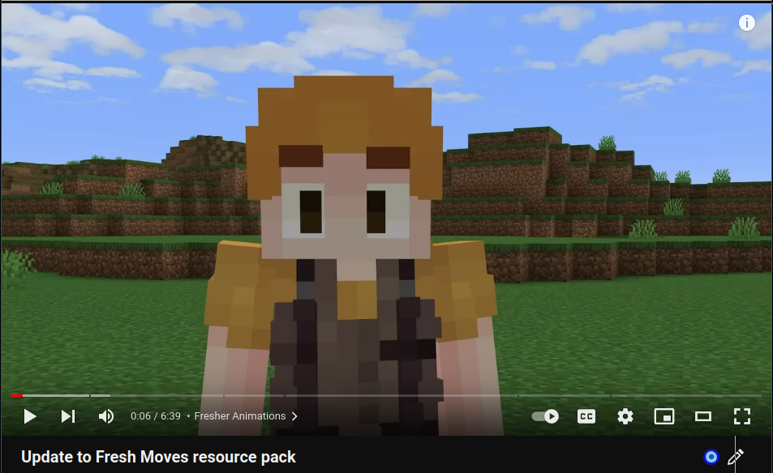

## Making Youtube More Understandable

Youtube as a platform has had more sensationalist and vague titles as of late. Many of these titles and thumbnails are hard to understand and may be misleading completely, which proves the need for [DeArrow](https://dearrow.ajay.app/).

DeArrow is a browser extension that crowdsources titles and thumbnails to replace the original sensationalist versions. This, as said by the developer Ajay, "is to make titles accurate and reduce sensationalism." 

## My History with DeArrow

I found DeArrow on Youtube around December of last year, and decided to give the small $1 donation that it was asking for a license key. This allowed me access to DeArrow past the 24hr trial they provide.

This extension allows for the easy renaming of titles through a ui that opens within youtube, allowing for all users to contribute easily. 
This allows for users to easily contribute to the project, leading to the editing of 156,000 titles and 77,000 thumbnails by 15,000 users. 

I enjoyed a lot of newfound clarity provided by these articles, but I wanted to also contribute to the efforts.

## The Rules

There are more rules to submitting titles other than making titles more vague. While neutralizing the title was one of the main guidelines, they were suprisingly robust and can handle many use cases. I was able to take a look at them to get a good handle on how I should go about naming titles. 

I also took a look at the Discord to maybe see what not to do. I was shocked to find that DeArrow was a part of a larger project called SponsorBlock, which is designed to skip sponsor segments in videos. I mostly found reports of bad segments for sponsor block. I was able to find some discussions on what titles should be modified and how. 

## Trying for Myself

There was not much left to do other than just submitting some titles, so thats what I did. I started watching a video, one that was named "The Animation Update".

I watched the video, continuing and finding out more about the topic. This video was about a resource pack called Fresh Moves, and how it was updated to support more eye types. I changed the title and got this.

I decided to spend a day doing this, getting around 7 done. I would have gotten more but I found that many of the videos I have seen have titles that are well descriptive of the video, and that renaming it would detract from that. Overall I have gotten a total 30 done so far, but this is not one that I am stopping anytime soon.
