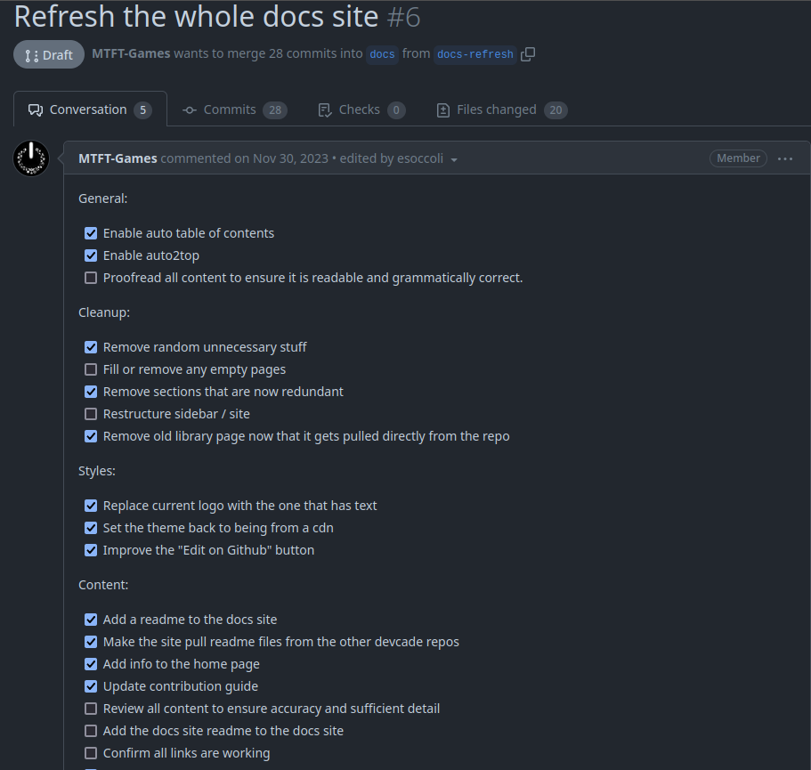
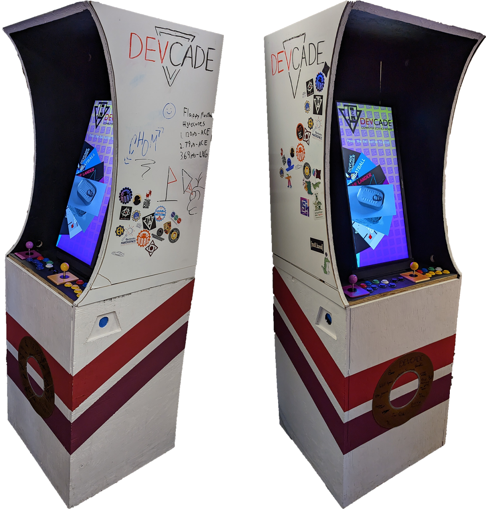
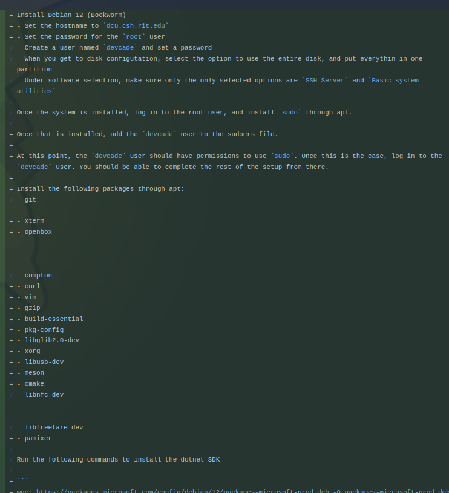
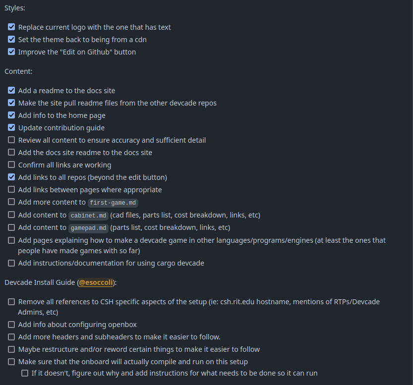

For my contribution, I decided to contribute to the [Devcade documentation site](https://github.com/ComputerScienceHouse/devcade-docs). Specifically, I contributed to an existing draft PR to refresh the entire docs site (PR link [here](https://github.com/ComputerScienceHouse/devcade-docs/pull/6))

I chose this as my contribution because I wanted to help improve the documentation of the various aspects of the Devcade project. The documentation for Devcade is currently in a weird state where there is some documentation for certain parts of the project, and no documentation for other parts. Additionally, a lot of the documentation that we do have is out of date and/or structured in a somewhat confusing way. My goal with this contribution was to help to fix this by adding documentation to things that don't have any, and improve existing documentation to ensure that it is up to date and easy to follow.

## What is Devcade?
Devcade is a custom arcade cabinet built entirely from scratch by members of [Computer Science House (CSH)](https://csh.rit.edu) here at RIT. The goal of the project was to make a fully open source platform for people to make games and play games made by others. The project started in the fall of 2022, and was in active development throughout the entire 2022 - 2023 academic year, with multiple people actively adding features and making improvements. Throughout the 2023 - 2024 academic year, progress was noticeably slower than the the previous year. Despite that though, many improvements did get made throughout the year, and numerous people made new games for the machine. There have not been a ton of contributions over the past couple of weeks, due to people being busy with classes and final exams, but I expect to see much more active development in the fall. In fact, one of the most recent developments to the Devcade project is the start of a collaboration with MAGIC to make a Devcade cabinet for the MAGIC building. As of writing this, the current status is that we have agreed on some basic conditions for the collaboration, and will start looking at plans for making happen in the fall.

## What did I do?
As described above, I contributed to the Devcade documentation website as a way to help get the documentation for the project in a good state. One of the biggest things I did was writing up a guide for setting up a Devcade system. Towards the end of last semester, I did set up a full Devcade system from scratch and took notes on everything that I did in the process, because the only install guide that we had at the time was a year old, and we had made some fairly significant changes since then, meaning that the existing guide was very out of date. What I did for this contribution was find my notes from that install, and followed them step by step in a VM in order to confirm that the instructions were still accurate. Once I was done with that, I reformatted my notes into a step by step install guide, and added that to the documentation website.

In addition to that, I also went through the current docs site and made a list of things that I wanted to add/change, and organized that list into categories based on the type of change. I then put that list into the draft PR that I was contributing to so that I wouldn't forget anything, and so that I could easily keep track of what I still needed to do.

Beyond that, I went through and proofread all of the pages on the docs site, making spelling and grammar changes as necessary.

## Next Steps
While I did contribute a decent amount to the documentation, there is significantly more work that still needs to be done. I plan to continue working on the Devcade documentation, because while my changes will be helpful, there are still numerous other things that are either not documented at all, or are poorly documented. With the current state of the Devcade documentation, it is very difficult for anyone who is not already familiar with the project to get involved, which is something I want to change. My goal is to get the documentation to a state where anyone who reads it will be able to understand how all the different parts of the project work and how to contribute. In order to do this, I have a list of changes I want to make, which includes, but is not limited to, the following list:

1. Add details to the hardware pages (ex: parts lists, cost breakdown, cad files, etc)
2. Write up a contribution guide so that people who want to contribute know where to start
3. Reformat pages to make them more readable
4. Ensure all content is easy to read and understand (rewrite sections if necessary)
5. Proofread all content
6. Remove any redundant content and/or pages