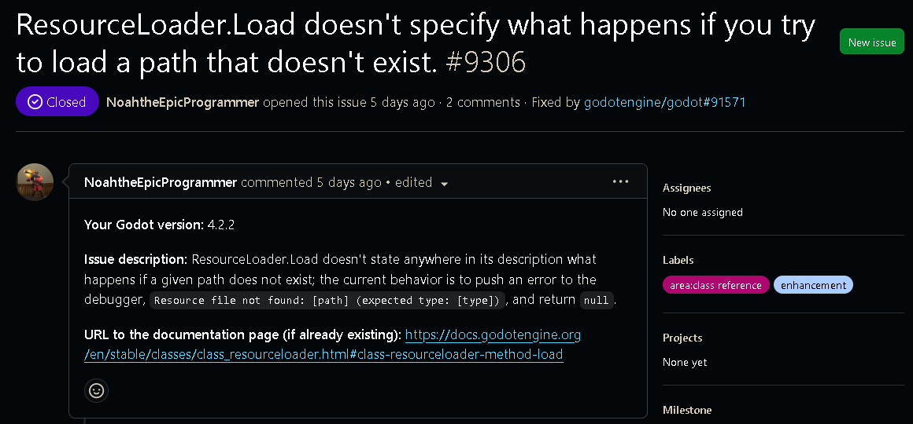
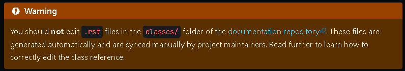
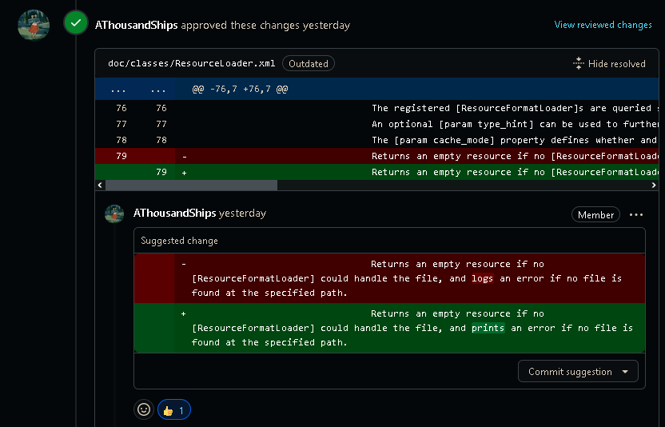
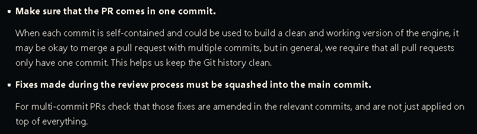
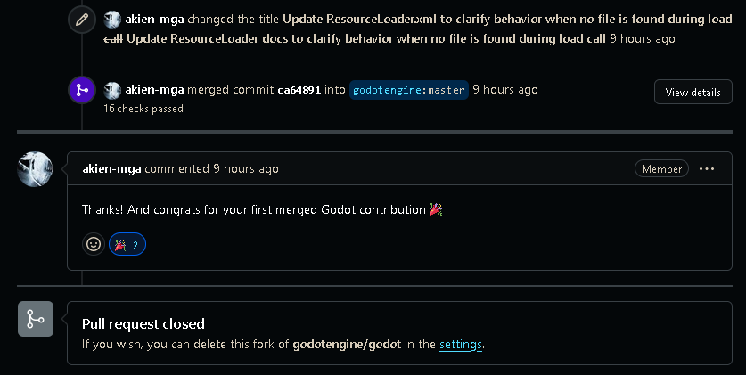

## What is Godot?
Godot is an open-source game development engine for both 2d and 3d games.  The project is a stadium, and was made as a closed source game dev engine back in 2001, remaining closed source until 2014 wwhen it adopted the MIT license.

## Why pick Godot?
Initially, Unity's pricing model fiasco put Godot on my radar as a cool game engine.  More recently, a group in one of my game dev courses made a platformer using the engine that I helped playest, which reminded me of the project when it came time to contribute.  I wasn't sure if I wanted to contribute to MonoGame again for this project or not, but I chose to contribute to Godot after taking a look at its very, very detailed wiki, which leads me into the next section...

### Is Godot a good project to contribute to?
Yes.  The project has multiple lines of communication available to potential contributors and users, with extensive documentation on methods in Godot, building Godot from source, contributing to the project, and even on git functions like rebasing (which they ask that you use so small contributions only comprise a single commit).  

### Godot resources I used to help me help them
For the work itself, I referenced the [resource loader documentation](https://docs.godotengine.org/en/latest/classes/class_resourceloader.html) to learn a bit more about the code I would be writing documentation on, and referenced the C++ [header file](https://github.com/godotengine/godot/blob/7cdad333114e6765351ed0facb48db228ef29b7b/core/io/resource_loader.h#L74) and [source file](https://github.com/godotengine/godot/blob/7cdad333114e6765351ed0facb48db228ef29b7b/core/io/resource_loader.cpp#L147) to see firsthand how the method worked.  I also referenced the [content guidelines](https://docs.godotengine.org/en/latest/contributing/documentation/content_guidelines.html) and [writing guidelines](https://docs.godotengine.org/en/latest/contributing/documentation/docs_writing_guidelines.html) to ensure my contribution was stylistically consistent with the rest of the project and easy to comprehend.

When it came time to create my pull request, I read the [pull request review process](https://docs.godotengine.org/en/latest/contributing/workflow/pr_review_guidelines.html), which told me the format that Godot preferes for contributions.  Linked from there, the [pull request workflow](https://docs.godotengine.org/en/latest/contributing/workflow/pr_workflow.html#doc-pr-workflow) page gave step-by-step instructions on how to format my contribution so all of my commits could be "rewritten" into just one, so the main projects commit history could be easily readable.

## The Issue
### How I decided on my issue
For my contribution, I wanted to contribute to Godot's documentation, as I'm one of those strange people who actually enjoys writing documentation and combing through code trying to puzzle out its purpose.  That, and I'm a bit rusty on my coding skills and didn't want to make a sub-par contribution to the project, so I stuck to something I'm very confident in.

I started looking for an issue in the [godot-docs](https://github.com/godotengine/godot-docs) repo, as thats the one I figured most documentation issues would be in, and found [an issue](https://github.com/godotengine/godot-docs/issues/9306) posted just three days before I began my search.  I knew I wanted to do this one just as a glance, as I could tell from the description of the issue that this was one of those "'minor' problems that break your code for four hours while you try to diagnose them," and having just finished a 10-week game mod project for IGME 424, problems like those hurt my soul and I wanted to help.

### Similarities and differences from my bug fix
This contribution actually has a lot in common with my bug fix.  For starters, both are documentation improvements.  They're also both for game engines, though the contribution is for Godot, not Monogame.  This issue was less thorough in its explanations, though, so I had to do a few hours more research into the project to really get an in-depth feel of what was going on.

### My initial plan for contributing
My initial plan was to clone the [godot-docs](https://github.com/godotengine/godot-docs) repo and modify one of the file that the resource loader documentation webpage was built from, [resourceloader.rst](https://github.com/godotengine/godot-docs/blob/master/classes/class_resourceloader.rst), and then to create a pull request there.  I referenced the open source project Sphinx ([Documentation](https://www.sphinx-doc.org/en/master/)), that Godot uses to build its documentation, to learn the syntax of the .rst file before I began.

### Expectations, meet reality
After forking the [godot-docs](https://github.com/godotengine/godot-docs) repo and doing all of my work, I stumbled upon another page in Godot's documentation, the [guidelines for updating the class reference](https://docs.godotengine.org/en/latest/contributing/documentation/updating_the_class_reference.html#doc-updating-the-class-reference).  These guidelines say, in no uncertain words:

Oh.  The actual documentation is stored in the main repository in XML files typically located in `/docs/classes/`.  I went and cloned the main repository, ported my changed from the .rst file to the .xml file, and I was good to go.

I created my [pull request](https://github.com/godotengine/godot/pull/91571) on the 4th and got feedback that the wording could be a bit more clear, so back I went to my fork of the repo.

The change itself was so simple that I could've just hit the commit suggestion button in the pull request's page, but I wanted to pull only one commit into the main repo, like the contribution guidelines asked.

I made a second commit that changed the wording, then tried to rebase and squash my second commit into the first.  Honestly, I'm not sure why this didn't work, but there were still multiple commots in my PR, so I ended up deleting the extra commits via `git push --force` and amending the first one through Visual Studio 2022's UI.
### Conclusion
My pull request was successfully merged into the master branch this morning!  All in all, Godot was a fun project to contribute to.  The project has thorough documentation, the maintainers are very active, and I'm glad I got the chance to contribute to the project.

