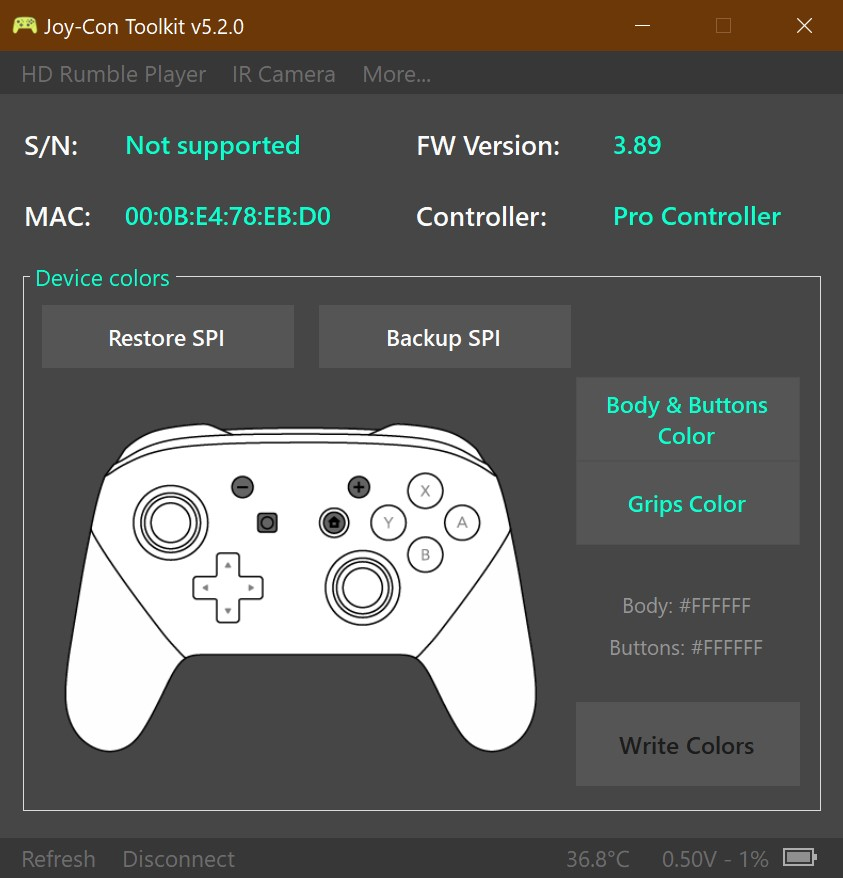

## **Joy-Con Toolkit**

For my contribution, I decided to work on a project called Joy-Con Toolkit by CTCaer. This is the same project as my bug fix, so I will skip the introduction.

### The Contribution(s)

For this assignment, I wanted to allow 2nd-party and 3rd-party Pro Controllers to work with the software. As Joy-Con Toolkit currently exists, only 1st-party (official Nintendo-made) Joy-Con and Pro Controllers can sync with the program. This is something I found out the hard way, as I tried to use the application over Spring Break to alter the on-screen colors of my Power-A Wireless Gamecube Pro Controller, but was unable to launch the app.

Compared to my bug fix of adding a few more preset color options to an existing interface, adding 2nd/3rd-party support initially seemed much more challenging. For starters, my experience working with Bluetooth is very limited, previously only using it for one specific purpose on entirely different hardware. Second, I do not know about the internals of various Nintendo Switch controllers. Perhaps there is a good reason that controllers other than official Nintendo devices can use the program, such as data being stored in different locations.

While I was comfortable connecting my controller to an edited program, I was too fearful of bricking my favorite (discontinued) controller, so I did not actually write the new colors to the remote. There is a non-zero chance that the contribution does not have the intended effect, but I do not currently have the means of verifying it. For this reason, I have decided to additionally submit some of the much-needed documentation to the project.

Note: An SPI Flash backup feature exists within the program, but using the complementary restore feature does not seem to write back the whole memory.

### The Coding Process

Looking through the official forum for the project, I found a few mentions of other users attempting "pseudo-3rd-party support". Diving into one of these forks by a user named linkoid, I found their implementation of 3rd-party support quite complex (not unlike the rest of the Joy-Con Toolkit application).

In an attempt to see if linkoid's implementation even fully worked, I added the necessary changes to my own fork and found myself able to start debugging the solution with my Power-A controller. Once I pressed accept on a new pop-up menu warning me of my alternative controller, I found myself on this screen.

As expected, this screen did not look like it should. The S/N was missing and the colors of the controller were being incorrectly displayed as pure white. The added code for psuedo-support was left in my fork as it does not interfere with already supported controllers, but remains an unproven and risky option. With my suspicion that data was stored differently on non-Nintendo controllers all but confirmed, I was left with documentation updates as my primary contribution.

### The Documentation/Licensing Process

While looking into the files, I realized that Joy-Con Toolkit actually used the MIT license, and included it in a text file at the top level of the project. Upon further inspection, most source files in the project did not include full per-file licensing, instead having either no license or only a reference to the LICENSE.txt file.

I added the MIT license, as writen above, into every source file that did not already contain its own license. This adds up to 18 files when not accounting for the Visual Studio solution file or autogenerated source files. Before I was finished with my contribution, I knew that the README.md file also needed updates. The existing README included nearly zero information about the project, only featuring an image of the primary user interface, the pre-requisites needed to get the solution running on another computer, a link to the official forum (since abandoned by CTCaer), and references to three other Github pages.

For the sake of accessibility, I sought to add some of the information from the official forum into the README. I added the description of the program as well as an abbreviated change log, decisions made to create a more streamlined experience in learning about the project. Now, new users on the Github page do not need to search through links to find the forum, and users have slightly more information available at their fingertips through their workspace.

As the project has been abandoned by its creator, my previous pull request from the bug fix is still awaiting response. Because of this, everything has been merged into one the one pull request, and I updated the name of the pull request accordingly.

