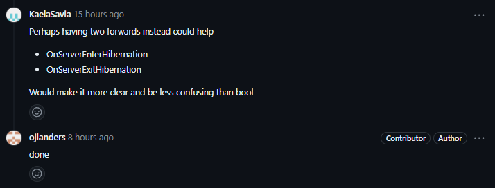

# Why stick with SourceMod?
I chose to stick with SourceMod for my contribution for a couple of reasons. Firstly, I am now familiar with their workflow after doing my bug fix with SourceMod, so I didn't have to learn a new workflow with a different project. Secondly, I personally use and love SourceMod, and there are plenty of features that can be added for a better overall user experience.

# What is SourceMod?
SourceMod is a modding framework for different Source engine games, that provides a scripting language (SourcePawn) that can be used to manipulate game behavior without the original source code of the game DLLs.

# The Feature Request
For my contribution, I decided to implement a feature request on SourceMod's GitHub repository. The request was titled "Add OnServerHibernate() and OnServerHibernate_Post() forwards #1483" and was posted by user PlayBoy31 on Apr 20, 2021. The request was as follows:

> Hello,
>
> Can some implement a forward to be notified when server goes on hibernate state please?
>
> Cases for exemple:
>
> - setup plugins/scripts just before hibernate
> - make sql queries just before the sleep (because we need to use the main thread before it sleep, otherwise it can cause troubles)
> - others actions that must be done when the server goes in this state
>
> 2 forwards like OnServerHibernate() and OnServerHibernate_Post() will be very nice !

# What is Hibernation?
Hibernation is when the server goes into a state where it only runs a frame when it receives messages and it never asks the game DLL (server.dll) to simulate a game frame (in SV_Think). Hibernation occurs when the server is empty on newer Source Engine versions (as in, including and after Left 4 Dead, or SDK 2013 games that are updated to include hibernation).

# Beginning the Contribution
I saw that there was already a hook for ServerHibernationUpdate in playermanager.cpp and asked on the SourceMod Discord if it would be a good idea to put the new forward in there. Here's my message:

> Hello, 
>
> I am interested in adding the OnServerHibernate() forward as detailed in https://github.com/alliedmodders/sourcemod/issues/1483.
>
> I don't think OnServerHibernate_Post() is practical to implement, as by the time hibernation has started CServerPluginCallbacks::GameFrame will no longer be called.
>
> The easiest way to implement the forward would be to add the call to the forward in PlayerManager::OnServerHibernationUpdate(bool bHibernating) as it gets called from CGameServer::SetHibernating as it hooks CServerGameDLL::ServerHibernationUpdate .
>
> My question is: would it be proper to add it within PlayerManager::OnServerHibernationUpdate and PlayerManager::OnSourceModAllInitialized, or would it make more sense to split it off to its own method?
>
> Thank you.

I got a reply from psychonic, a SourceMod developer:

> I think adding in the spots you mentioned makes the most sense
>
> That's roughly how the other server lifecycle forwards are handled (OnMapStart, etc)

# The Initial Pull Request
With the go-ahead from a developer, I made my initial pull request. Here's the diff:

```diff
diff --git a/core/PlayerManager.cpp b/core/PlayerManager.cpp
index 3feb79478e..f938ca0114 100644
--- a/core/PlayerManager.cpp
+++ b/core/PlayerManager.cpp
@@ -59,6 +59,7 @@ bool g_OnMapStarted = false;
 IForward *PreAdminCheck = NULL;
 IForward *PostAdminCheck = NULL;
 IForward *PostAdminFilter = NULL;
+IForward *ServerHibernationUpdate = NULL;
 
 const unsigned int *g_NumPlayersToAuth = NULL;
 int lifestate_offset = -1;
@@ -203,6 +204,7 @@ void PlayerManager::OnSourceModAllInitialized()
 	PreAdminCheck = forwardsys->CreateForward("OnClientPreAdminCheck", ET_Event, 1, p1);
 	PostAdminCheck = forwardsys->CreateForward("OnClientPostAdminCheck", ET_Ignore, 1, p1);
 	PostAdminFilter = forwardsys->CreateForward("OnClientPostAdminFilter", ET_Ignore, 1, p1);
+	ServerHibernationUpdate = forwardsys->CreateForward("OnServerHibernationUpdate", ET_Ignore, 1, NULL, Param_Cell);
 
 	m_bIsListenServer = !engine->IsDedicatedServer();
 	m_ListenClient = 0;
@@ -254,6 +256,7 @@ void PlayerManager::OnSourceModShutdown()
 	forwardsys->ReleaseForward(PreAdminCheck);
 	forwardsys->ReleaseForward(PostAdminCheck);
 	forwardsys->ReleaseForward(PostAdminFilter);
+	forwardsys->ReleaseForward(ServerHibernationUpdate);
 
 	delete [] m_Players;
 
@@ -778,6 +781,10 @@ void PlayerManager::OnSourceModLevelEnd()
 
 void PlayerManager::OnServerHibernationUpdate(bool bHibernating)
 {
+	cell_t res;
+	cell_t data = static_cast<cell_t>(bHibernating);
+	ServerHibernationUpdate->PushCell(data);
+	ServerHibernationUpdate->Execute(&res);
 	/* If bots were added at map start, but not fully inited before hibernation, there will
 	 * be no OnClientDisconnect for them, despite them getting booted right before this.
 	 */
diff --git a/plugins/include/clients.inc b/plugins/include/clients.inc
index d88262f1c1..a5f6487a6d 100644
--- a/plugins/include/clients.inc
+++ b/plugins/include/clients.inc
@@ -215,6 +215,15 @@ forward Action OnClientPreAdminCheck(int client);
  */
 forward void OnClientPostAdminFilter(int client);
 
+/**
+ * Called directly before the server hibernation state changes.
+ * This is your last chance to do anything in the plugin before
+ * hibernation occurs, as SV_Frame will no longer be called.
+ *
+ * @param state         The new hibernation state.
+ */
+forward void OnServerHibernationUpdate(bool state);
+
 /**
  * Called once a client is authorized and fully in-game, and 
  * after all post-connection authorizations have been performed.  
```

And a test script:

```c
#include <sourcemod>

public void OnServerHibernationUpdate(bool state)
{
    PrintToServer("Server hibernation state changed to: %s", state ? "true" : "false");
}
```

Here's the output:

```
sm_cvar sv_hibernate_when_empty 0
[SM] Changed cvar "sv_hibernate_when_empty" to "0".
L 05/05/2024 - 23:11:48: [basecommands.smx] "Console<0><Console><Console>" changed cvar (cvar "sv_hibernate_when_empty") (value "0")
Server waking up from hibernation
Server hibernation state changed to: false
sm_cvar sv_hibernate_when_empty 1
[SM] Changed cvar "sv_hibernate_when_empty" to "1".
L 05/05/2024 - 23:11:49: [basecommands.smx] "Console<0><Console><Console>" changed cvar (cvar "sv_hibernate_when_empty") (value "1")
Server is hibernating
Server hibernation state changed to: true
```

I tested it by creating a Left 4 Dead 2 dedicated server and using the sm_cvar command to toggle `sv_hibernate_when_empty` on an empty server to see if it worked (and it did!).

# Feedback and Improvements
After submitting the pull request, a conversation ensued on the SourceMod Discord:


Headline, another project lead, also left a comment on the pull request:


Based on this feedback, I updated the documentation to better explain what the `state` parameter means. However, I decided to keep the name `OnServerHibernationUpdate` to mirror the actual name of the function in the engine.

KaelaSavia then suggested a different approach:



I liked this idea, so I updated the pull request to have two separate forwards, `OnServerEnterHibernation` and `OnServerExitHibernation`, instead of a single forward with a boolean parameter. Here's the new diff:

```diff
diff --git a/core/PlayerManager.cpp b/core/PlayerManager.cpp
index 3feb79478e..1d541daa36 100644
--- a/core/PlayerManager.cpp
+++ b/core/PlayerManager.cpp
@@ -59,6 +59,8 @@ bool g_OnMapStarted = false;
 IForward *PreAdminCheck = NULL;
 IForward *PostAdminCheck = NULL;
 IForward *PostAdminFilter = NULL;
+IForward *ServerEnterHibernation = NULL;
+IForward *ServerExitHibernation = NULL;
 
 const unsigned int *g_NumPlayersToAuth = NULL;
 int lifestate_offset = -1;
@@ -203,6 +205,8 @@ void PlayerManager::OnSourceModAllInitialized()
 	PreAdminCheck = forwardsys->CreateForward("OnClientPreAdminCheck", ET_Event, 1, p1);
 	PostAdminCheck = forwardsys->CreateForward("OnClientPostAdminCheck", ET_Ignore, 1, p1);
 	PostAdminFilter = forwardsys->CreateForward("OnClientPostAdminFilter", ET_Ignore, 1, p1);
+	ServerEnterHibernation = forwardsys->CreateForward("OnServerEnterHibernation", ET_Ignore, 0, NULL);
+	ServerExitHibernation = forwardsys->CreateForward("OnServerExitHibernation", ET_Ignore, 0, NULL);
 
 	m_bIsListenServer = !engine->IsDedicatedServer();
 	m_ListenClient = 0;
@@ -254,6 +258,8 @@ void PlayerManager::OnSourceModShutdown()
 	forwardsys->ReleaseForward(PreAdminCheck);
 	forwardsys->ReleaseForward(PostAdminCheck);
 	forwardsys->ReleaseForward(PostAdminFilter);
+	forwardsys->ReleaseForward(ServerEnterHibernation);
+	forwardsys->ReleaseForward(ServerExitHibernation);
 
 	delete [] m_Players;
 
@@ -778,6 +784,11 @@ void PlayerManager::OnSourceModLevelEnd()
 
 void PlayerManager::OnServerHibernationUpdate(bool bHibernating)
 {
+	cell_t res;
+	if (bHibernating)
+		ServerEnterHibernation->Execute(&res);
+	else
+		ServerExitHibernation->Execute(&res);
 	/* If bots were added at map start, but not fully inited before hibernation, there will
 	 * be no OnClientDisconnect for them, despite them getting booted right before this.
 	 */
diff --git a/plugins/include/clients.inc b/plugins/include/clients.inc
index d88262f1c1..51ed0bb1ef 100644
--- a/plugins/include/clients.inc
+++ b/plugins/include/clients.inc
@@ -215,6 +215,18 @@ forward Action OnClientPreAdminCheck(int client);
  */
 forward void OnClientPostAdminFilter(int client);
 
+/**
+ * Called directly before the server enters hibernation.
+ * This is your last chance to do anything in the plugin before
+ * hibernation occurs, as SV_Frame will no longer be called.
+ */
+forward void OnServerEnterHibernation();
+
+/**
+ * Called directly before the server leaves hibernation.
+ */
+forward void OnServerExitHibernation();
+
 /**
  * Called once a client is authorized and fully in-game, and 
  * after all post-connection authorizations have been performed.  
```

# Merge and Conclusion
With the changes made, the pull request was approved by both Headline and psychonic, the two project leads who had been involved in the discussion. 8 hours later, the pull request was merged!


Overall, this was a great experience in contributing to an open source project. I was able to implement a requested feature, get feedback from the project maintainers, make improvements based on that feedback, and ultimately get the changes merged. It was also a good lesson in the importance of naming and documentation in making code clear and usable for other developers.
