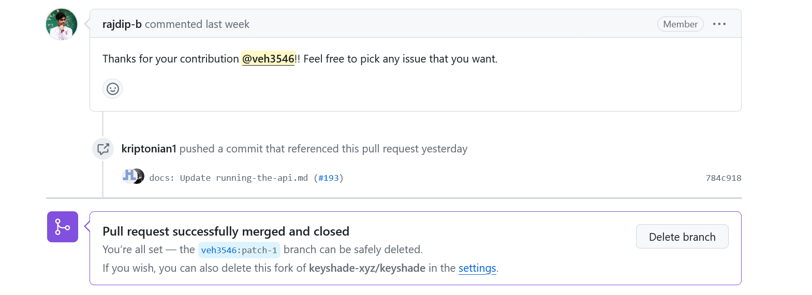

## **Keyshade**
### What The Project Is:
**Keyshade** is a Open Source configuration management platform, built to simplify the process for developers. It can be found [here](https://github.com/keyshade-xyz/keyshade). It describes itself as a "realtime secret and configuration management tool, with the best in class security and seamless integration support"

### Why I Picked It:
**I picked this project because** my BugFix project, Autogen, didn't have any open issues at my skillset. I was interested in doing documentation work, so I searched for good first issues in that subject area on http://goodfirstissues.com/. I also liked that the porject was independently managed, in congtrsast to my previous BugFix that was managed by Microsoft.  

### How My Comm Arch Experience Helped Choose A Community:

**My CommArch experience** helped me know how to determine the activity of the community so that I would have a good chance of getting merged for this deadline. Despite the small number of contributers, my questions were answered quickly and my contributions were reviewed fast. 

## **Contributing**
### What resources Were Already Available:
Autogen has lots of **user resources** [here](https://docs.keyshade.xyz/) and a contributor guide [here](https://github.com/keyshade-xyz/keyshade/blob/develop/CONTRIBUTING.md).  It uses the Mozilla Public License [License](https://github.com/keyshade-xyz/keyshade/blob/develop/LICENSE) and has its own [Code of Conduct](https://github.com/keyshade-xyz/keyshade/blob/develop/CODE_OF_CONDUCT.md)

## **The Issue**
### How I Picked My Issue And What It Was:
**I chose issue  #186** which I found from its “good first issue” and "documentation" labels. The issue was to fix incorrect documentation about testing the API and was created by Rajdip Bhattacharya, the project's Founder.  It was described as “This portion of our docs is outdated. We need to update it with the latest testing steps.” and provided this screenshot:

### How I Went About Pursuing It (And The Challenges Therein): 
**First**, I commented on the issue, saying that I would like to work on it and asking for clarity on what they wanted. 

I forked the project and made my first attempt at fixing the documentation. Obviously, its hard to do documentation for a project you don't know, so we had a few back and forth reviews to fix things.

## **Success!**
I created a fork of the project on **04/25/24** and a day or so later, my pull request was **accepted and merged** into the development branch by Rajdip Bhattacharya. 

## **Conclusion**
I think I liked the experience of contributing to a smaller project better than Autogen, it just felt more personal. I also felt more confident contributing to this one as well since I had more experience with GitHub and the contribution process. I did have some problems understanding what exactly the issuer wanted but I don;t know if that was a communication error or because I was unfamilar with the project.

